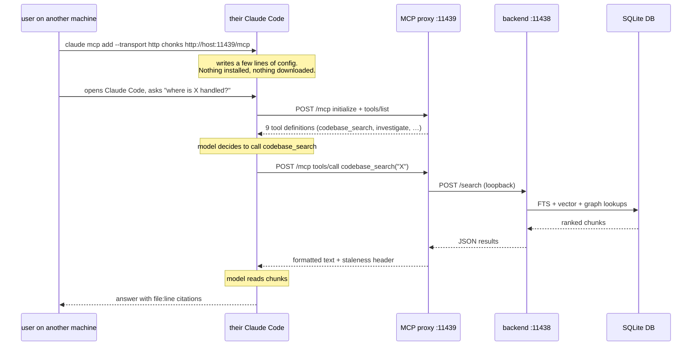
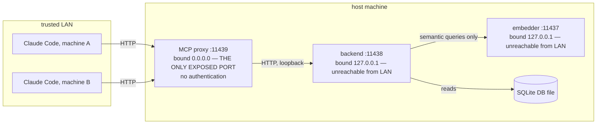
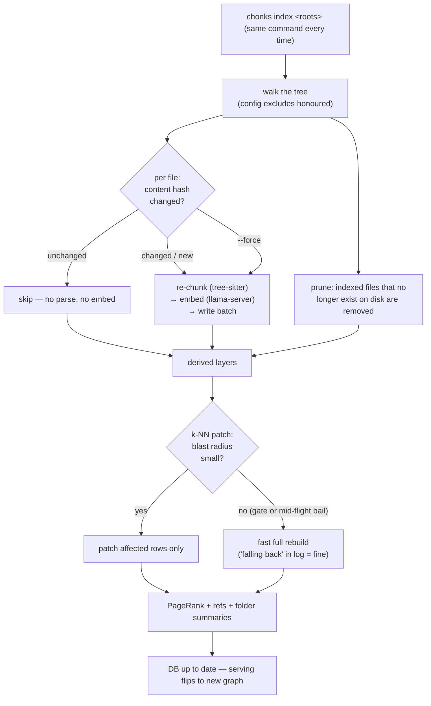

# Running Chonks as a shared service

This document is written for the person who operates a Chonks instance that other machines query. It covers the mental model, the one-time setup, the embedder, indexing, what happens when people query while an index is being built, and how client machines register. Containers have their own section, failure modes follow, and a command reference organised by role closes the file. Windows is covered inline.

## 1. How it works

Chonks consists of four processes and one file.

```
 you (once per code change)                     other machines (whenever)
 ┌──────────────────────┐                      ┌─────────────────────┐
 │ chonks index …       │                      │ Claude Code         │
 │ (CLI, minutes-hours) │                      │  → HTTP POST /mcp   │
 └─────────┬────────────┘                      └──────────┬──────────┘
           │ writes                                       │
           ▼                                              ▼
      ┌─────────┐   reads    ┌──────────────┐   ┌─────────────────────┐
      │ .db file│ ◄───────── │ backend      │◄──│ MCP proxy (node)    │
      │ (SQLite)│            │ (Python,     │   │ 0.0.0.0:11439       │
      └─────────┘            │ 127.0.0.1:   │   │ translates MCP ↔    │
                             │ 11438)       │   │ backend HTTP        │
                             └──────┬───────┘   └─────────────────────┘
                                    │ only for semantic queries
                                    ▼
                             ┌──────────────┐
                             │ llama-server │  (embedder, :11437 —
                             │ (GPU)        │   also used by `index`)
                             └──────────────┘
```

The DB is the product. It is one SQLite file that holds the chunks, the embeddings, the full-text index, the symbol table, and the reference graph, and everything else is a stateless process around it.

The backend answers `/search`, `/symbol`, `/investigate`, and the other endpoints by reading the DB. It binds loopback, so nobody talks to it directly.

The MCP proxy translates MCP tool calls into backend HTTP calls and formats the results, adding the staleness header and the provenance labels. In HTTP mode one proxy serves everyone. The host script `scripts/host.ps1` runs it and spawns the backend as well, which is called managed mode, and restarts the backend if it dies.

The embedder, llama-server, turns text into vectors. It is needed during indexing for every chunk, and at query time for the `semantic` and `hybrid` modes, where it embeds the query string. It is not needed for fts or regex search or for any of the graph tools, because the vectors those use are already stored in the DB.

Other machines install nothing. Their Claude Code speaks MCP over HTTP directly to the proxy, and the one command they run writes a few lines of configuration containing a URL. There is no node, no Python, and no checkout of Chonks on their side. They do want a checkout of the indexed codebase, so that the `path:line` citations resolve.



### Ports and trust

There is no authentication anywhere in Chonks. The backend and the embedder bind loopback and are unreachable from the network. The proxy is the only exposed port, and exposing it is a decision to make for a trusted network only, since anyone who can reach it can query the index and read the source it returns.



Where the network is not trusted, bind the proxy to a specific interface, add a firewall rule, or reach the host over a VPN such as Tailscale or WireGuard. Do not expose the port to the internet.

**`config.json`'s `language_plugins` runs code, and it widens an existing surface rather than opening a new one.** Every name in that list is imported — `importlib.import_module`, module-level code and all — by every `chonks` process that reads the config it's in: `chonks index`, `chonks serve` (including the backend the MCP adapter spawns), `chonks doctor`, and `chonks report`. There is no sandbox and none is planned.

Before `language_plugins` existed, config already led to code-adjacent trust decisions of its own: `db` names the sqlite file that gets written, `codebase` the directory that gets read and served, and `embed_url` the URL every chunk of the indexed source is POSTed to — data exfiltration, though not execution. And a `.py` file dropped into the installed `chonks/languages/` directory is already imported on the first `import chonks.languages`, no plugin mechanism involved; "no third-party loading" there has only ever been enforced by the filesystem, not by code. `language_plugins` is the first config key that leads to execution rather than to reads, writes, or POSTs, and the mechanism it uses — `importlib.import_module` on an attacker-controlled string — needs the module to already be importable; it does not let an attacker place a file, so the realistic threat is config plus a writable directory on `sys.path`, or config plus an already-installed malicious package.

What's new is specifically this: a string in a JSON file now selects a module to import, so the config file itself has to be trusted at the level of `sys.path` and site-packages, not just as data. `chonks/core/config.py` auto-discovers `config.json`, `chonks/config.json`, and `.chonks.json` relative to the working directory for `serve`, `index`, `doctor`, and `report` alike; a `.chonks.json` left inside a cloned repository is picked up by any of the four run from that directory, and `language_plugins` has no guard against it (the absolute-`codebase` guard under [Failure modes](#8-failure-modes) is the closest existing precedent, and it does not cover this key).

## 2. One-time setup on the host machine

The prerequisites on PATH are `uv`, `node` (18 or newer, from a system package, nvm, Volta, or fnm, since uv does not manage it), and llama-server if semantic search is wanted.

Start the embedder first, since `chonks index` embeds every chunk through it; section 3 covers it. Then, on macOS or Linux:

```
git clone https://github.com/mgonzalez01/Chonks.git ~/Chonks
cd ~/Chonks
uv sync
uv run chonks init
uv run chonks index /path/to/src --db /path/to/src/.db/chonks.db --config config.json
scripts/host.sh --db /path/to/src/.db/chonks.db --config config.json
```

On Windows:

```powershell
git clone https://github.com/mgonzalez01/Chonks.git C:\Chonks ; cd C:\Chonks
uv sync
uv run chonks init
uv run chonks index C:\src --db C:\src\.db\chonks.db --config .\config.json
.\scripts\host.ps1 -Db C:\src\.db\chonks.db -Config .\config.json
```

`uv sync` creates `.venv` from `uv.lock`. `chonks init` is an interactive wizard: it confirms each exclude with a file count and a size, writes `config.json` with the codebase root, the excludes, the DB path, and the embedder URL, and prints a `claude mcp add` line. `chonks index` and `chonks serve` take the DB path from that file when `--db` is omitted; the host scripts take it as an explicit parameter.

The host script builds the proxy on first run, starts the proxy and the backend, restarts the backend if it dies, and prints the `claude mcp add` line for the other machines. It binds `0.0.0.0` because its purpose is to serve other machines, and since there is no authentication it must run only on a trusted network. The firewall needs to allow the port.

The proxy checks the `Host` header of every request, ignoring case. It accepts the loopback names, this machine's hostname in full and short form, and its network addresses, and prints the list at startup. A client that reaches it by any other name, such as a DNS alias, needs that name in `CHONKS_MCP_ALLOWED_HOSTS`, comma-separated, before starting the script. A rejected request gets HTTP 421 with a message naming the host, and the proxy logs it.

The window must stay open, since it is the service. To survive logout and reboot, register it as a scheduled task; section 9 gives a Windows example.

### Starting the pieces by hand

The host scripts start the backend and build the proxy. Start the backend separately only for a setup that does not use them, such as the remote backend in section 6:

```bash
uv run chonks serve --db .db/chonks.db --config config.json
# → http://127.0.0.1:11438
```

`curl http://localhost:11438/status` verifies it, and `--log-level debug` adds per-request detail, research iteration traces, and embedding truncation events. `--host 0.0.0.0` binds all interfaces so that a remote MCP client can reach it, which puts the unauthenticated HTTP API on the network under the trust rules from section 1; a reverse proxy with basic auth is another option here.

For a local stdio registration, the proxy is built with `npm install` and `npm run build` in `mcp-server/`; `/mcp` in Claude Code then shows `chonks` with its nine tools.

## 3. The embedder

Any OpenAI-compatible `/v1/embeddings` endpoint works, and the model name is recorded in the DB. The recommended and measured model is jina-code-embeddings-0.5b. Its licence is CC-BY-NC-4.0, which excludes commercial use, so for a commercial deployment an Apache-2.0 model such as Qwen3-Embedding-0.6B should be used instead; the README's embedder section gives the trade-off, and DESIGN.md gives the measurements behind the recommendation. The standard setup is llama-server with a code-embedding GGUF, for example:

```
llama-server --hf-repo jinaai/jina-code-embeddings-0.5b-GGUF `
  --hf-file jina-code-embeddings-0.5b-F16.gguf `
  --embedding --pooling last --port 11437 --parallel 16 --ctx-size 65536 -ngl 99
```

`--pooling last` is required, since this is a last-token-pooling model, and `-ngl 99` offloads all layers to the GPU. The value of `--ctx-size / --parallel` is the per-slot token budget and must stay at or above the largest chunk. 65536 / 16 gives 4096, which is right for dense code, whereas 8192 / 8 gives 1024 and makes the server reject batches. The GGUF is pulled from Hugging Face on first run and cached under `%USERPROFILE%\.cache\huggingface`, or wherever `HF_HOME` points. F16 or Q8 is preferable, since embeddings are sensitive to quantisation. For the Apache-2.0 alternative, the two `--hf-*` lines become `Qwen/Qwen3-Embedding-0.6B-GGUF` and `Qwen3-Embedding-0.6B-f16.gguf`, `embed_model` in the config is set to a name containing `qwen3`, and a separate DB is used, since the dimension is 1024 rather than 896.

There are three ways to run it.

1. Separately, by hand. This is typical when it already runs for other purposes. `host.ps1` pings port 11437 at startup and warns if nothing answers.
2. Owned by the host script, by passing `-LlamaServer <path\llama-server.exe> -EmbedModel <hf-repo or .gguf path>`. It is then started before the proxy and stopped with it.
3. Not at all. `serve` probes the embedder at boot and refuses to start without it, so `CHONKS_ALLOW_DEGRADED=1` must be exported before the host script. Keyword and regex search then work, semantic and hybrid return an error, and research reports itself as degraded.

The embedding model is tied to the DB. The model name is recorded on first insert, and opening the DB with a different `embed_model` configured raises immediately, so that vector spaces are never mixed. Changing models therefore means a `--force` re-index, and changing the output dimension means a new DB file. The query-side and document-side instruction prefixes follow `embed_model` automatically, so switching is a config change and nothing else; DESIGN.md covers the presets.

### Throughput tuning

The embedding server gates indexing speed, so the lever is keeping the GPU fed. Two config keys control it, `embed_batch` (chunks per request, default 128) and `embed_inflight` (concurrent in-flight requests, default 2), with matching `--embed-batch` and `--embed-inflight` flags, taken CLI first, then config, then default. They only matter during indexing. The defaults suit a heavy model, where a 4B model saturates the GPU with a single 128-batch. A small, fast embedder such as jina-code-0.5b drains a batch far faster and starves on them, so raise `embed_inflight` to 8 and `embed_batch` to 256 or 512, together with llama-server's `--parallel`, keeping `--ctx-size / --parallel` at or above the largest chunk.

Index a single subsystem first to time the throughput. The chunker prints `Embedded N chunks in Ts (X chunks/s)` at the end of a run; that line together with `nvidia-smi` shows whether the GPU is fed. Lightly loaded CPU cores are expected here.

### A remote embedding server

`embed_url` and `embed_model` are config keys, with matching `--embed-url` and `--embed-model` flags, so the embedder can live on a different machine, typically a workstation GPU on the LAN while the indexing runs on a smaller device:

```bash
# On the GPU box: bind to LAN, not localhost
llama-server --hf-repo <model> --host 0.0.0.0 --port 11437 --embedding
```

```jsonc
// In config.json on the machine that indexes and serves
"embed_url":   "http://192.168.x.x:11437/v1/embeddings",
"embed_model": "jina-code-embeddings-0.5b"
```

llama-server has no authentication, so bind it on a trusted LAN only, pinned to the specific LAN interface if the host is multi-homed. Wired Gigabit handles a 128-chunk batch comfortably, at about 2 MB per round trip; Wi-Fi works and adds variable latency. Per-project `embed_url` and `embed_model` overrides are honoured under the `projects` map.

## 4. Indexing: first, incremental, forced

The first index (`chonks index <roots…> --db … --config …`) walks the tree, honouring the config excludes, parses each file into AST-aware chunks with tree-sitter, embeds every chunk through llama-server, writes everything, and then builds the derived layers: the reference graph, the k-NN neighbours, PageRank, and the folder summaries. It is GPU-bound, and roughly 50 to 100 chunks per second on a decent GPU can be expected, so a 400k-chunk corpus is an hours-scale first build that lands at roughly 300 to 400 MB of DB.

Three progress bars are shown, Parsed, Queued, and Embedded, and at the default `info` level the parser also logs `Parsed <path-from-root> (<N> chunks)` per file, so a hang on a pathological file shows up as a long pause after the last logged path. `PARSE ERROR` lines use the same form.

Re-running the same command is automatically incremental. For each file, Chonks compares a stored content hash, and unchanged files are skipped entirely. Changed files are re-chunked and re-embedded, and files that disappeared are pruned at the end of the walk. The derived layers then update incrementally as well. The k-NN graph patches only the affected rows, unless the blast radius of the change makes a from-scratch rebuild cheaper, in which case it switches automatically; the log line "falling back to full rebuild" is that fast path. A re-run with no changes is a few minutes of hashing on a big tree and almost no writes, and a small change is seconds to minutes.

The operating loop is therefore one command. A nightly scheduled task is fine, since repeat runs are cheap.



`--force` re-chunks and re-embeds everything regardless of the hashes. It is needed when the pipeline changed rather than the code, for example after switching embedding model:

```
uv run chonks index /path/to/src --db /path/to/src/.db/chonks.db --config config.json --force
```

`--exclude path/` adds excludes on the command line, on top of those in the config. `--rebuild-graphs` re-runs the post-index passes (`build_refs`, `build_neighbors`, `build_folder_summaries`) against the existing DB without re-parsing or re-embedding, which recovers a DB whose chunks are indexed but whose graphs are empty. `--rebuild-knn` skips `build_refs` and re-runs only `build_neighbors`, PageRank, and `build_folder_summaries`, which is the flag to use when only `chunk_neighbors` is stale, since `build_refs` dominates wall clock at scale, about 25 minutes per 385k chunks against about 8 minutes for the k-NN graph. With `chunk_refs` empty it falls back to the full `--rebuild-graphs` chain and warns.

A second root outside the primary tree is stored with absolute paths as seen by the host, so citations for those files will not resolve on the other machines. Roots should stay on the primary tree where possible.

Once the index is built, expect 0.5 to 1 second per semantic query, 10 to 100 ms for FTS, and 100 ms to 1 second for regex.

### GPU backends for the k-NN build

The k-NN pass is a matmul, and it runs on a device backend when one is available. The choice is automatic: cupy with a working device selects `cuda`, otherwise MLX selects `mlx`, otherwise numpy on the CPU, and the build logs which one it chose. The CUDA extra installs with `uv sync --extra cuda`, and on the CPU path with 50,000 chunks or more the build warns and names that install line. `"knn_backend"` in `config.json` on the indexing host takes `cuda`, `mlx`, or `numpy` and overrides the automatic choice; an explicit `cuda` raises when cupy or a device is missing. `CHONKS_KNN_BACKEND` overrides the config for one invocation, and a value outside `auto|numpy|mlx|cuda` is rejected at startup. The backends apply only where the result is bit-identical to the CPU path and fall back to numpy otherwise, a gate DESIGN.md explains.

## 5. Indexing while people are connected

This is safe, nobody is disconnected, and it is the normal way to operate.

```mermaid
gantt
    dateFormat X
    axisFormat %s
    section indexer
    walk + embed + write batches       :a, 0, 8
    derived layers (kNN/PageRank/refs) :b, 8, 10
    section what queries see
    old + progressively newer chunks (WAL snapshots) :c, 0, 8
    graph tools still serve the OLD graph            :d, 0, 10
    everything new                                   :e, 10, 12
    section embedder
    saturated by indexing (semantic queries queue)   :f, 0, 8
```



Reads keep working. The DB is SQLite in WAL mode, the indexer writes in batches, and readers never block on the writer, while the writer waits up to 5 seconds on a lock rather than failing. Queries during an index see the corpus as of the last committed batch, a mix of new and old chunks that converges to fully new as the run proceeds, and since batches are transactions there are no torn chunks.

Semantic queries become slower. The cost is seconds per query.

The graph tools lag until the end. Neighbours, PageRank, and refs are rebuilt after the walk completes, so `investigate`, `trace_path`, and `codebase_map` serve the previous graph during the run and then switch over.

Agents are informed. Every MCP response carries a staleness header ("index: N chunks · built Xh ago", or Xd once the index is a day or more old, refreshed at most every 45 seconds), so a consuming agent can see that the index has moved.

Only one index at a time should run per project. The HTTP `/index` endpoint takes a per-project lock and returns 409 if a build is already running. The CLI path is a separate process and does not share that lock, so two index commands must not be run against the same DB at once; there is no guard for that case.

In the worst case, a host reboot in the middle of an index, the DB stays consistent under WAL, finished batches persist, and unfinished files are indexed again on the next run.

## 6. Registering client machines

The host scripts run the MCP server as a stateless Streamable HTTP transport at `/mcp` instead of a per-client stdio child process, which is the zero-install path: each other machine runs `claude mcp add --transport http chonks http://host:11439/mcp` and installs nothing. `CHONKS_MCP_HTTP_PORT` and `CHONKS_MCP_HOST` control the port and the bind address, the default bind being `127.0.0.1` and the host scripts setting `0.0.0.0`, and `--http <port>` does the same on the command line. The rest of this section covers setups that want a local MCP process instead, which is about your own machine running both pieces, not about registering someone else's.

### Backend lifecycle: managed and manual

A locally registered MCP server can own the backend or not. Setting `CHONKS_SERVER_PY`, the path to `chonks/server.py`, enables managed mode on its own; `CHONKS_DB` and `CHONKS_CONFIG` are passed through as `--db` and `--config` to the backend it spawns. The MCP server then spawns `server.py` as a child process on startup, polls `/status` until it is ready with a 30-second timeout, and sends SIGTERM on shutdown, so no separate terminal is needed. Leaving `CHONKS_SERVER_PY` unset gives manual mode, where `chonks serve` is started by hand first and the MCP server pings `/status` once at startup and reports a clear error if it is unreachable. The ping happens before the spawn, so a backend that is already running is not duplicated and the two modes coexist.

### Optional env vars

| Env var | Default | Purpose |
|---|---|---|
| `CHONKS_URL` | `http://localhost:11438` | Backend base URL. |
| `CHONKS_PY_CMD` | `uv run python` | Interpreter for spawning `server.py` in managed mode. |
| `CHONKS_RESEARCH_TIMEOUT_MS` | `900000` (15 min) | Client-side timeout for `codebase_research` calls, which run long on large corpora. |
| `CHONKS_SUBSYSTEMS` | — | Inline JSON `{name: [paths]}` map for `@subsystem` prefixes, taking precedence over `CHONKS_CONFIG`. |

### A local stdio registration

`claude mcp add` writes `~/.claude.json` for user scope and `.mcp.json` at the project root for project scope; Claude Code does not read `.claude/mcp.json`. `chonks init` prints the command with the paths filled in, and the general form is:

```
claude mcp add chonks -s user \
  -e CHONKS_URL=http://localhost:11438 \
  -e CHONKS_SERVER_PY=/absolute/path/to/Chonks/chonks/server.py \
  -e CHONKS_DB=/absolute/path/to/Chonks/.db/chonks.db \
  -e CHONKS_CONFIG=/absolute/path/to/Chonks/config.json \
  -e "CHONKS_PY_CMD=uv run python" \
  -- node /absolute/path/to/Chonks/mcp-server/dist/index.js
```

In PowerShell the line continuation is a backtick rather than a backslash. With `-s project`, the file written holds a `command` of `node`, an `args` list holding the path to `dist/index.js`, and an `env` map of the five variables; it can be committed and shared, and `mcp.team.example.json` is a filled-in example. `CHONKS_PY_CMD` takes `python3` when uv is not used.

### MCP locally, backend on another host

The MCP server is a thin stdio adapter that runs wherever the MCP client runs, and the backend can live on a different machine, for example a NAS that holds the index while the laptop runs only the adapter. On the backend host, start `serve` bound to a LAN-reachable address:

```bash
uv run chonks serve --host 0.0.0.0 --db /path/to/chonks.db --config /path/to/config.json
```

On the client machine, register the same `node .../mcp-server/dist/index.js` command with `CHONKS_URL` set to `http://192.168.x.x:11438` and the three lifecycle variables omitted, so that the MCP server does not spawn a local backend. This puts the backend's unauthenticated HTTP API on the LAN, under the trust rules from section 1. `mcp.team.example.json` and `chonks-subsystems.example.json` are worked examples.

## 7. Containers

The compose file builds two images from the Dockerfile, `--target backend` for the Python service and `--target mcp` for the adapter, and runs them as the `backend` and `mcp` services. The data directory is mounted into both, read-only for the adapter. To bring the stack up, copy `.env.example` to `.env`, place a DB at `${CHONKS_DATA:-./data}/chonks.db` with a `config.json` next to it, and run:

```
docker compose up -d
```

Only the MCP proxy is published, and by default only on 127.0.0.1. `CHONKS_MCP_BIND=0.0.0.0` in `.env` publishes it to the LAN. Inside the container the proxy's own hostname and addresses are the container's, not the host machine's, so for a LAN deployment `CHONKS_MCP_ALLOWED_HOSTS` in `.env` must list the hostname or IP address the other machines will use.

Forgetting the DB does not fail. `serve` creates a valid empty one and the stack reports healthy, so `/status` should be checked for `"never_indexed": true` and `chunks: 0`. The host scripts refuse to start on a missing DB; only the raw `serve` and container paths have this trap.

Forgetting the embedder does fail. `serve` probes it at boot and exits, `up` reports `dependency backend failed to start`, and `docker compose logs backend` prints the URL that was tried. Inside a container the built-in default, `localhost:11437`, never resolves, so `config.json` in `${CHONKS_DATA}` must set `embed_url` to `http://host.docker.internal:11437/v1/embeddings` for a llama-server on the host, or to `http://embedder:11437/v1/embeddings` for the embedder profile. `CHONKS_ALLOW_DEGRADED=1` in `.env` serves keyword-only instead.

Two optional profiles exist. `--profile embedder` runs a CPU llama-server, which is fine for queries but manages about 1 chunk per second when indexing, so large corpora should be indexed natively and the DB copied over. It must be started and waited for before indexing, since the indexer aborts after five consecutive connection failures rather than waiting for the model to load: `docker compose --profile embedder up -d --wait embedder`. For CUDA, set `CHONKS_LLAMA_IMAGE=ghcr.io/ggml-org/llama.cpp:server-cuda` and uncomment the `gpus: all` line under the embedder service in `docker-compose.yml`. `--profile index` indexes `CHONKS_SOURCE` into the data directory; `embed_url` must be reachable from inside the container, and with the CPU embedder `CHONKS_EMBED_BATCH=32` keeps each request inside the timeout.

Other machines register the container the same way as a native host, with `claude mcp add --transport http chonks http://<host>:11439/mcp`, and the steering text in section 9 applies to them as well.

## 8. Failure modes

**The index is stale.** Files changed since the last index are not in the results, and nothing detects on-disk drift. `codebase_status` reports `newest_indexed_at` to compare against the time of the last edits, and re-running `chonks index` refreshes it incrementally.

**The embedding server is down.** Indexing fails with HTTP errors, and `chonks serve` refuses to start, exiting with status 2 and naming the URL it tried, unless `--allow-degraded` is passed. If the embedder goes down while the server is running, `/search` in semantic and hybrid modes returns 503 and `/research` returns `degraded: "semantic_unavailable"`, which the MCP `codebase_research` tool prints as a `DEGRADED` first line, while FTS and regex keep working. The failing tool call carries the error.

**The MCP server cannot reach the backend.** In manual mode, `chonks serve` has to be started by hand. In managed mode, check that `CHONKS_SERVER_PY`, `CHONKS_DB`, and `CHONKS_PY_CMD` point at the right things; the MCP server's stderr carries the backend's exit code and startup error, and it polls `/status` for 30 seconds before giving up.

**Embedding token overflow during indexing.** Chunks near `CHUNK_MAX` can exceed the per-slot budget when the content is token-dense, as with CRC tables, hex arrays, or dense macros. The embedder bisects the failed batch to isolate the offending chunk, so the rest keep full-length embeddings and only the culprit is truncated, down to the `EMBED_MIN_CHARS` floor. The log lines to watch for are:

```
EMBED batch failed (512 chunks), isolating: <httpx 4xx>
EMBED ERROR src/core/crc.cpp:12: ...   # only if a chunk fails even at the floor
```

The `isolating` line is a recovery, and its truncations are silent apart from the summary's `batch_failures` and `truncated` counts. `EMBED ERROR` means the chunk was skipped, either because it failed even at the floor or because of an error truncation cannot fix. Repeated `EMBED ERROR` lines with `httpx.ConnectError` or similar mean the embedding server is probably down and should be restarted before the index continues.

The end-of-run summary reports `chunks_per_s` and four counts: `batch_failures`, the batches that hit the bisection retry; `oversize_chunks` and `oversize_files`, the chunks over `CHUNK_MAX` that the chunker byte-split, which come from long-line or data files and in quantity mean that `CHUNK_MAX` is too tight or that those files should be excluded; `truncated`, the chunks whose embedding came from a shrunk-input retry; and `errors`, the chunks dropped entirely. If `batch_failures` or `truncated` is a non-trivial fraction of the run, the per-slot context budget is too tight: raise `--ctx-size`, lower `--parallel`, since each slot gets `--ctx-size / --parallel` tokens, or lower `CHUNK_MAX`. A larger `embed_batch` raises the cost of each failure, so fix the budget before raising the batch.

**A client shows `chonks` as needing authentication.** Chonks has no authentication, so the prompt cannot succeed. Proxy builds before the 421 change answered a rejected `Host` header with 403, which Claude Code takes as an OAuth challenge: it attempts client registration, fails with a 404, and records the server in `~/.claude/mcp-needs-auth-cache.json` under its name. `claude mcp remove` and a new `claude mcp add` do not clear that record. Update and restart the host, which rebuilds the proxy, then on each affected client delete the `chonks` entry from that file and restart Claude Code.

**An auto-discovered config with an absolute `codebase` is ignored.** `resolve_codebase` in `chonks/core/config.py`, called by `serve` only, rejects an absolute `codebase` path from a config file it auto-discovered, that is, the cwd's `config.json`, `.chonks.json`, or `chonks/config.json` — the same search list shared by `serve`, `index`, `doctor`, and `report` — since a config dropped there could otherwise scope the `/index` endpoint to arbitrary locations. Passing `--config <path>` explicitly makes it an opt-in, and relative paths are always honoured, resolved against the cwd.

**A worker thread crashes during indexing.** The indexer raises a `RuntimeError` and exits instead of hanging. The parser sets a 30-second per-file deadline through `tree_sitter.Parser.timeout_micros`, and a file that makes the grammar loop is logged as `PARSE ERROR` and skipped, so the run continues. An exception that escapes the worker loop, such as an OOM, a broken queue, or an unexpected SQLite error, is re-raised as `RuntimeError: Parser/Embedder worker crashed: ...` after the pipeline shuts down. Chunks committed before the crash stay in the DB, and a re-run processes the affected files again.

**A cross-language query returns half the answer.** Where the coupling crosses languages, for example a GDScript call and the C++ method it binds to through `ClassDB::bind_method`, embedding similarity may surface only one side. Search each language separately, or use `codebase_map` on the subsystem covering both to find the coupling structurally.

## 9. Reference

**On another machine, complete install:**

```
claude mcp add --transport http chonks http://<host>:11439/mcp
```

Then `/mcp` in Claude Code confirms it, and `claude mcp remove chonks` removes it.

**On another machine, the steering text.** The file [`mcp-server/CLAUDE.template.md`](mcp-server/CLAUDE.template.md) should be copied into the project's `CLAUDE.md` or into `~/.claude/CLAUDE.md`. This step is not optional. On the 24-question Godot harness with Sonnet 5 and deferred tools, a one-line recommendation led to 4 runs out of 24 using the tools, and the text placed in CLAUDE.md led to 24 of 24; see [`eval/results/F1`](eval/results/F1/README.md) for the per-run rows. The forcing therefore lives in the user's rules file and not in anything the server can send.

**Host, Windows, serve:** `.\scripts\host.ps1 -Db <db> -Config .\config.json [-LlamaServer <exe> -EmbedModel <repo|gguf>] [-Port 11439]`. A health check from anywhere is `curl http://<host>:11439/healthz`.

**Host, index and re-index** (the same command, incremental by nature): `uv run chonks index <roots…> --db <db> --config .\config.json [--force]`

**Autostart** (scheduled task, administrator):

```powershell
Register-ScheduledTask -TaskName ChonksHost -Trigger (New-ScheduledTaskTrigger -AtLogOn) `
  -Action (New-ScheduledTaskAction -Execute "pwsh" -Argument "-NoProfile -File C:\Chonks\scripts\host.ps1 -Db <db> -Config C:\Chonks\config.json")
```

**Config UI** (optional): `uv run python scripts/config_ui.py` serves a localhost-only form at http://127.0.0.1:11440 for `.env` (fields discovered from `.env.example`) and `config.json` (validated JSON; a parse error writes nothing). Saves are atomic with a `.bak`, and changes apply on the next restart of whatever consumes them. It is stdlib only and a host-side convenience; it should never be exposed.

**Windows traps.** JSON paths take forward slashes (`C:/Chonks/...`) or escaped `\\`, since a raw `\` is a JSON escape. PowerShell line continuation is a backtick, not `\`. If `uv` is not found right after installation, a new terminal is needed. The uv message "Failed to hardlink files; falling back to full copy" is harmless, as the cache and `.venv` are on different drives, and `setx UV_LINK_MODE copy` silences it. `ModuleNotFoundError: No module named 'uvicorn'` means the backend runs under the wrong Python; `uv sync` once in the Chonks directory and launching through `uv run` fixes it, or `CHONKS_PY_CMD` can point at `C:/Chonks/.venv/Scripts/python.exe`. A machine that powers off nightly is fine, since indexing is incremental and resumes where it stopped.

**Where things live:** `config.json` (roots, excludes, embedder, tuning), the `--db` file (the index), and `mcp-server/dist` (the built proxy). DOCS.md is the reference for the tools and the HTTP API, DESIGN.md explains why the system is built this way, and this file covers operating it.
