# Chonks — Technical Documentation

Local code RAG (Retrieval-Augmented Generation) for semantic search and deep research over codebases. It exposes an HTTP API on port 11438 and a Claude Code compatible MCP server that wraps it.

This file is the reference. Installing, running, tuning, and deployment are in [DEPLOY.md](DEPLOY.md); the reasoning behind the design, with the measurements, is in [DESIGN.md](DESIGN.md).

---

## Table of Contents

1. [Overview](#overview)
2. [When this helps, and when it doesn't](#when-this-helps-and-when-it-doesnt)
3. [Architecture](#architecture)
4. [Components](#components)
5. [HTTP API](#http-api)
6. [MCP Server](#mcp-server)
7. [Configuration](#configuration)
8. [Performance](#performance)

---

## Overview

Chonks answers questions about a codebase. It parses files into semantic chunks using tree-sitter, embeds them with a local model, and stores them in a sqlite-vec database with int8 quantization. On top of that it exposes four search modes (semantic, FTS, regex, hybrid) and a deep research mode, which returns a ranked candidate set for an outer LLM to synthesize into an answer.

The MCP server returns ranked chunks with `path:line` citations and the calling LLM writes the answer. There is no synthesis, no query-expansion LLM, and no cross-encoder reranker inside Chonks; the pipeline is embedding, BM25, and graph traversal.

**The `chonks` CLI.** The code lives in the `chonks/` package, and one console script dispatches to a subcommand per task:

| Subcommand | What it does |
|---|---|
| `chonks init` | Interactive first-run setup wizard |
| `chonks index` | Parse and embed source files into a chunks DB |
| `chonks serve` | Run the HTTP search, research, and index server |
| `chonks doctor` | Read-only index health report. Its flags are `--db`, `--config` (default: the first of `config.json`, `chonks/config.json`, `.chonks.json` present), and one repair flag, `--set-model`, which rewrites the recorded embedding-model label and exits without printing a report. |
| `chonks report` | Generate `INDEX_REPORT.md` |

Each subcommand's module is internal and the CLI is the only supported entry point. `chonks init` writes `config.json` and offers to run the first index; the Docker compose stack does neither, it runs the backend and the MCP adapter against a `chonks.db` and a `config.json` that already exist (see [DEPLOY.md](DEPLOY.md)).

**Two processes and one file.** An embedding server and the Python HTTP backend are the two running processes, and all state lives in a single sqlite file.

| Service | Port | Required for |
|---|---|---|
| Embedding server | 11437 (default) | Indexing (`chonks index`) and semantic query embedding. Endpoint and model name are config-driven (`embed_url`, `embed_model`); the server can run on `localhost` or any reachable host. |
| Python HTTP backend | 11438 | All queries (search, research, map) |

**Supported languages:**

<!-- generated:language-extensions:begin -->
| Language | Extensions |
|---|---|
| C | .c |
| C# | .cs |
| C++ | .cc .cpp .cu .cuh .cxx .h .hpp .hxx .inl .metal .mm |
| GDScript | .gd |
| HLSL | .fx .fxh .hlsl |
| JavaScript | .cjs .js .jsx .mjs |
| Lua | .lua |
| Python | .py .pyi |
| TSX | .tsx |
| TypeScript | .ts |
<!-- generated:language-extensions:end -->

CUDA (`.cu`/`.cuh`) and Objective-C++/Metal (`.mm`/`.metal`) are parsed best-effort under the C++ grammar, and Lua best-effort under its own. `.h` stays on the C++ grammar. Any other text extension is skipped by default; the config's `fallback_extensions` allowlist (HTML, Vue, Svelte, Markdown, YAML, TOML, and JSON by default) admits markup, docs, and config files through a line-based chunker, as described under [Configuration](#configuration).


## Architecture

```mermaid
flowchart TD
    CC["Claude Code / any MCP client"] -->|"MCP: JSON-RPC over stdio"| PROXY["mcp-server (Node/TypeScript)&#10;codebase_search &middot; codebase_research &middot; codebase_map&#10;codebase_status &middot; find_symbol &middot; find_usages &middot; investigate &middot; trace_path &middot; find_by_message"]
    PROXY -->|"HTTP :11438, loopback"| API["chonks/serve/ (FastAPI) &mdash; chonks serve&#10;/search /research /repomap /symbol /usages /outgoing /investigate /trace&#10;/index /status /find_by_message /impact /hubs"]
    API --> SEARCHER["chonks/retrieval/searcher.py&#10;search API"]
    API --> RESEARCH["chonks/retrieval/research.py&#10;candidate collection"]
    API --> REPOMAP["chonks/index/graph/&#10;symbol graph + persisted PageRank"]
    API --> CHUNKER["chonks/index/&#10;indexing &mdash; chonks index"]
    CHUNKER --> SUMM["chonks/index/summaries.py&#10;folder summaries"]
    SUMM -.->|"reads persisted PageRank"| REPOMAP
    SEARCHER --> STORE["chonks/storage/&#10;sqlite-vec DB"]
    RESEARCH --> STORE
    REPOMAP --> STORE
    CHUNKER --> STORE
    SEARCHER -.->|"query embedding"| EMB["Embedding server :11437"]
    CHUNKER -.->|"batch embeddings"| EMB
```



All Python modules live inside the `chonks/` package and are reached only through the `chonks` console script. PageRank is computed once at index time (`persist_pagerank`, churn-gated) and read from `chunk_pagerank` at query time, so `compute_pagerank_global` reads that table instead of solving the graph per request. Every edge in `chunk_refs`, every neighbor in `chunk_neighbors`, and every row in `symbols` comes from tree-sitter parsing and deterministic name resolution, so the same source produces the same graph on every re-index. [Components](#components) gives the extraction rules per language.

### Database schema

```mermaid
flowchart TD
    FILES["files&#10;id &middot; path &middot; size &middot; mtime&#10;content_hash &middot; indexed_at"] -.->|"per-file bookkeeping&#10;(skip / prune decisions)"| CHUNKS
    CHUNKS["chunks&#10;id (TEXT PK) &middot; path &middot; language &middot; chunk_type&#10;name &middot; start_line &middot; end_line&#10;content &middot; indexed_at &middot; metadata (JSON, nullable)"]
    CHUNKS -->|mirrors| FTS["chunks_fts&#10;FTS5 virtual &mdash; keyword search"]
    CHUNKS -->|mirrors| VECS["chunk_vecs&#10;vec0 virtual &mdash; int8 KNN"]
    CHUNKS --> REFS["chunk_refs&#10;(from_id, to_id) + edge_type&#10;calls/imports/inherits/xlang/associated/mentions&#10;cross-language bidirectional"]
    CHUNKS --> NEI["chunk_neighbors&#10;chunk to neighbor + distance&#10;k-NN edges for GraphRAG"]
    CHUNKS --> PR["chunk_pagerank&#10;chunk_id PK + score&#10;written at index time by persist_pagerank"]
    CHUNKS --> INDEG["chunk_indegree&#10;chunk_id + edge_type &middot; n&#10;precomputed fan-in, kept in sync with chunk_refs"]
    CHUNKS --> SYMS["symbols&#10;decoupled named boundaries"]
    CHUNKS --> LIT["chunk_literals&#10;chunk_id &middot; text &middot; skeleton &middot; line&#10;source-literal index for find_by_message"]
    LIT -->|mirrors| LFTS["literals_fts&#10;FTS5 virtual &mdash; literal/message search"]
    FOLD["folder_summaries&#10;per-folder summary + embedding"]
    MDEFS["macro_definitions&#10;path &middot; scan_key &middot; records&#10;#defines and type names per C/C++ file"]
    META["meta&#10;key-value: schema_version, chunker_version,&#10;pagerank_stale_chunks, ..."]
    GNODES["graph_nodes&#10;id &middot; kind &middot; path &middot; parent_id&#10;dir/file hierarchy, separate from chunks"]
    GEDGES["graph_edges&#10;(from_id, to_id) + edge_type&#10;'contains' edges over graph_nodes"]
    GNODES --> GEDGES
```



The tables:

- `chunks`, the retrieval unit, one row per AST-bounded or fallback line-sliced span, mirrored by triggers into `chunks_fts` and `chunk_vecs`.
- `files`, per-file bookkeeping (path, size, mtime, content hash, index time) driving the skip and prune decisions.
- `chunk_refs`, the structural graph of who calls, imports, inherits, or mentions whom, consumed by `find_usages`, `trace_path`, and `codebase_research`.
- `chunk_neighbors`, the semantic-similarity graph, top-K nearest neighbours per chunk over the embeddings.
- `chunk_pagerank`, precomputed ranking written at index time and read at every `/repomap` call.
- `chunk_indegree`, the fan-in of `chunk_refs` per `(chunk_id, edge_type)`, written at graph-build time and read by `/hubs`.
- `symbols`, the decoupled named-boundary index, since the chunker sometimes folds several named things into one `chunks` row while `find_symbol` and `find_usages` need every name individually addressable.
- `chunk_literals`, mirrored into `literals_fts`, holding every decoded string literal a chunk contains plus a hole-collapsed skeleton, populated at parse time and consumed only by `find_by_message`.
- `folder_summaries`, one row per folder with its summary text and embedding.
- `macro_definitions`, each C and C++ file's `#define` lines and type names under its content hash, read by the indexer before parsing.
- `meta`, key-value: `schema_version`, `chunker_version`, `language_set`, `pagerank_stale_chunks`, `macro_vocab`, `unhealable_hashes`, `literal_index_version`.
- `graph_nodes` and `graph_edges`, the directory and file containment hierarchy (`dir:` and `file:` nodes plus `contains` edges), kept separate from `chunks` and `chunk_refs`.

---

## Components

### chonks/ops/init.py — First-Run Setup Wizard

Writes `config.json` for a new install, from `uv run chonks init` or `make init`. It prompts for the codebase path, then scans it for junk-directory candidates by name heuristic (`node_modules`, `.venv`, `venv`, `.git`, `__pycache__`, `dist`, `build`, `target`, `packages`, `coverage`, `DerivedData`, `Intermediate`, `Saved`) and offers each as a yes/no toggle with a file count and a size, excluded by default and confirmed one at a time. Then come a fallback-extensions toggle (defaulting to `chonks.index.admission.DEFAULT_FALLBACK_EXTENSIONS`), a DB path prompt, an embedding-server URL prompt whose `ping_embedder` reports reachability and dimension, and an embedding model name prompt (defaulting to `jina-code-embeddings-0.5b`, which selects the query and document prefixes and must match the model the server runs). It writes `config.json`, refusing to clobber an existing one without confirmation, prints the `claude mcp add` command, and offers to start the first index.

**Non-interactive mode.** `--yes` with `--codebase`, `--db`, `--embed-url`, `--embed-model`, and `--exclude` (repeatable) skips every prompt. Scan-detected exclude suggestions apply there only when `--auto-exclude` is passed as well.

---

### chonks/index/ — Indexing Pipeline

In: a source tree. Out: rows in `chunks`, `symbols`, and `chunk_literals`, plus the derived graphs. Chunks follow AST boundaries, that is, functions, classes, and structs. Three concurrent stages, a scan producer, a parser thread, and an embedder thread, are joined by bounded queues (`parse_q` at 64, `embed_q` at 2000).

**Scan.** The producer walks the tree, applies the exclude and include prefixes, hashes each file inline, and pushes it to `parse_q` when the hash changed. It runs the orphan prune itself after the walk, since pruning needs the complete `scanned_stored` set, and commits its pre-deletes and prunes once at the end. The progress bar starts as an indeterminate `Scanning N file` counter and switches to `Parsed n/M` when the scan finishes.

**Chunking algorithm:**
1. Parse the file into a tree-sitter AST, with the macro self-heal loop for C++.
2. Collect structural boundary nodes (functions, classes, structs, templates) via typed filter.
3. Split oversized boundaries recursively, falling back to line-based slicing when a node has no inner boundaries. `_enforce_ceiling` then byte-splits anything still over `CHUNK_MAX`, for example a single multi-megabyte line.
4. Merge segments below `CHUNK_MIN` into neighbours.
5. Fold in top-level module residue, gap-fill any unclaimed byte span, and absorb identity-free leftovers, so no source byte is dropped.
6. Emit `chunk_type`, `name`, `start_line`, `end_line`, and the refs metadata per chunk.

**Embedding.** Chunks go out in batches of `embed_batch` (default 128) with `embed_inflight` (default 2) requests in flight, both settable from config and from `--embed-batch` and `--embed-inflight`. `embed_phase` runs in a `ThreadPoolExecutor(max_workers=embed_inflight)` and `commit_phase` runs serially on the embedder thread, draining futures FIFO, so insertion order matches submission order. Before a chunk is sent, leading and trailing whitespace is stripped per line and consecutive blank lines are collapsed, while the DB stores the original content; embeddings are fetched as `encoding_format: base64`, and a server that returns float arrays instead still works.

**Retry and bisection.** A failed batch, for example one holding a chunk over the server's per-slot token budget, goes to `_embed_isolating`, which retries each half at full length and recurses only into the half that still fails, so the offender's batch-mates keep full-length embeddings. A failed batch bumps `state["batch_failures"]`, a truncated chunk `state["truncated"]`, and a dropped chunk `state["errors"]`, all three appearing in the end-of-run summary.

**Post-commit passes**, churn-gated, in this order: `build_refs` (typed, mentions, and xlang edges), `build_neighbors` (semantic k-NN), `persist_pagerank` (weighted by `edge_type_weights`), `build_folder_summaries`. Each consumes the same changed and deleted chunk-id delta, collected once in `index_paths`.

**Fallback chunk overlap.** AST-boundary chunks do not overlap. Line-fallback chunks split at arbitrary positions, so each one after the first gets the last `FALLBACK_OVERLAP_LINES` (default 5) lines of its predecessor prepended, while `start_line` and `end_line` stay canonical and non-overlapping.

**Chunk size constants:**

| Constant | Value | Purpose |
|---|---|---|
| `CHUNK_TARGET` | 4500 chars | Line-based fallback slice target (char count, accumulated as `len(line)`) |
| `CHUNK_MIN` | 300 bytes | Below this, merge segment forward into next (UTF-8 byte count) |
| `CHUNK_MAX` | 6000 bytes | Hard ceiling, guaranteed: oversized boundaries are AST/line-split and `_enforce_ceiling` byte-splits any remainder, even a single giant line (~1500 tokens; UTF-8 byte count) |
| `EMBED_MIN_CHARS` | 200 chars | Truncation floor for the bisection retry; a chunk still overflowing below this is dropped to `errors` |
| `FALLBACK_OVERLAP_LINES` | 5 lines | Overlap applied only to line-fallback chunks |
| `PARSE_TIMEOUT_MICROS` | 30 000 000 µs | Per-file tree-sitter parse deadline (30 seconds) |

Merge-time comparisons are in UTF-8 bytes, since `_Segment.size()` and `_SyntheticSegment.size()` both return bytes. Line-fallback accumulation stops when the summed `len(line)`, a character count, reaches `CHUNK_TARGET`, so its segments can be slightly larger in bytes for multi-byte content.

**Chunker versioning (`CHUNKER_VERSION = 4`).** `meta.chunker_version` records it and `chonks doctor` warns on a mixed-version DB. Version 4 recognises `#` in GDScript and `--` in Lua as comments; before it, both fell to the C-style default, so a span of nothing but comments was not seen as one and stayed a chunk of its own instead of folding into the code it labels. Version 3 absorbs identity-free trivia fragments into a neighbouring named chunk, line-slices oversized module residue with real per-piece line numbers through `_enforce_ceiling`, and salvages individually the intact boundaries a parse failure glued into an error-recovery node.

**Language-set provenance (`meta.language_set`).** A `{name: version}` map of every registered language, written beside `chunker_version`. It makes a boundary change in one language visible even when `CHUNKER_VERSION` has not moved. `Store` logs one warning when a DB's recorded set differs from the code's; a DB indexed before the key existed records nothing and is not treated as a mismatch.

**Parse failure is graded, not binary.** tree-sitter always returns a tree, and "failed" means one of three things:

1. **Timeout** (30s per file, `Parser.timeout_micros`), the only total failure: the file is skipped, has no chunks and no symbols, and is invisible to every tool. It is logged as `PARSE ERROR` and the run continues, as it does for a grammar that raises `ValueError: Parsing failed` on malformed input.
2. **Partial** (`root_node.has_error` after the heal loop), which ticks `parse_error` in the summary. Boundaries come from what parsed cleanly and the gap-fill backstop captures the error regions as `module` or `block` chunks, so the content stays searchable while symbols, typed edges, `find_symbol`, `find_usages`, and `trace_path` thin out there. `parse_error_files` and `chonks doctor` name the candidates.
3. **Clean**, no errors and full structure.

**Macro definitions (C and C++).** Before any file is parsed, the index reads the `#define` lines and type names (`class`, `struct`, `union`, `enum`, `typedef`, `using`) of every C and C++ file as text, with no preprocessor, and classifies each defined name over all of its `#ifdef` branches, the most cautious reading winning. The parse buffer keeps its byte offsets and newlines while:

- a macro-shaped name that stands for nothing or for attributes only (`#define API __declspec(dllexport)` in one branch, `#define API` in the other) is blanked in every file, except on directive lines and inside the arguments of a function-like macro the project defines (`PNG_FUNCTION(void *, f, (int n), PNG_ALLOCATED)`);
- a wrapper, a function-like macro that only adds attributes around its one argument (`#define LOCAL(type) static type`), loses its name and parentheses and keeps the argument;
- a macro that stands for a type is replaced by that type when it fits in the name's length;
- a type, and a macro that writes a declaration by placing two of its parameters side by side (`#define DECL(type, name) type name`), is never blanked, by self-heal or from the saved vocabulary.

A block comment just before a directive's line continuation (`do { /* note */ \`) is blanked as well: tree-sitter ends the `#define` there, and the rest of the body would parse as code. Each file's records are kept in `macro_definitions` under its content hash, so a re-index reads only changed files and indexing one folder still sees the macros the rest of the repo defines.

**Macro self-heal (C and C++).** The macros the definitions leave open, those defined outside the repo such as Unreal's `UCLASS` and those that expand to code such as `GDCLASS`, still make tree-sitter-cpp set `has_error`, so self-heal finds candidate names structurally, blanks them (arguments included, nested parentheses and all, never on a directive line), reparses, and keeps a candidate only when the error count dropped. A candidate is ALL_CAPS, optionally wrapped in underscores, or `_Capital..._`, the shape of Windows SAL annotations such as `_In_`; it is found as a call-shaped statement, in an error region, in a class head, before or after a function signature, between a return type and the name (`ULONG STDMETHODCALLTYPE AddRef()`), or before a parameter. A type the file itself defines is never a candidate, nor is a function it defines with a return type (`static void DC4(...)` also called as `DC4(dst, top);`). Because blanking either the macro or the type beside it can fix the same line, a name is dropped again when the other admitted names already fix what it fixed, likely types first, so a real type such as `RID` is not hidden. A macro in a class head (`class _WARN_UNUSED_ HashSet {`) often leaves no parse error at all, so it is admitted when blanking it turns the head back into a class body without adding an error. A macro that heals at least two distinct files in a run, counting only files whose heal removed at least half their errors, is promoted into `meta['macro_vocab']` and pre-blanked on later runs; the `macros` config key seeds that vocabulary, with the Unreal names in `config.example.json` and the Godot ones discovered on the first run. Content whose sweep admits nothing has its hash recorded in `meta['unhealable_hashes']`, FIFO-capped, so later runs including `--force` skip it; the memo is dropped when the vocabulary or the heal logic changes, so an improved heal reaches content an older one gave up on.

**Dominance warning.** `chonks doctor` groups chunks into path families by top-level path segment (root files as `(root)`), reporting per family the chunk count, corpus share, file count, chunks per file, and docs share, where docs means "not one of `chonks.index.segment.CODE_LANGUAGES`", the split `chunk_kind` also uses. `chonks index` prints a one-line warning at the end of a run when one family is both mostly docs (80% or more within it) and large (40% or more of the corpus), or when corpus-wide docs chunks reach 50%; it names the family and prints a ready-to-paste `exclude` snippet, changing nothing itself.

#### Include / exclude paths

The scan producer skips files whose portable path starts with a configured exclude prefix, from `exclude` in `config.json` or `--exclude`. The optional `include` list (peer to `exclude`, also `--include`) overrides a matching exclude when strictly more specific. Both lists are normalised to forward-slash form with a trailing slash, and matching is by longest prefix:

- `exclude: ["tmp/"]`, `include: ["tmp/git/a/"]` → everything under `tmp/` is skipped except files under `tmp/git/a/`.
- `exclude: ["thirdparty/"]`, `include: ["thirdparty/embree/"]` → only that vendored library gets indexed.
- Ties favour exclude, so an include must be strictly longer than the matching exclude to rescue a path.
- An `include` with no matching exclude is a no-op. The list is an exception mechanism, never an allowlist.

Excluded directories are pruned from the walk, include-aware, so a directory is skipped only when no `include` reaches into it. The count is logged at scan completion and returned from `index_paths` as `dirs_pruned`, separate from the orphan-prune `pruned` counter.

**Boundary nodes by language:**

<!-- generated:language-boundaries:begin -->
| Language | Extensions | Detected boundaries |
|---|---|---|
| C | .c | enum_specifier, function_definition, struct_specifier, type_definition, union_specifier |
| C# | .cs | class_declaration, constructor_declaration, conversion_operator_declaration, destructor_declaration, enum_declaration, interface_declaration, method_declaration, operator_declaration, property_declaration, struct_declaration |
| C++ | .cc .cpp .cu .cuh .cxx .h .hpp .hxx .inl .metal .mm | class_specifier, function_definition, struct_specifier, template_declaration |
| GDScript | .gd | class_definition, function_definition |
| HLSL | .fx .fxh .hlsl | function_definition, struct_specifier |
| JavaScript | .cjs .js .jsx .mjs | class_declaration, function_declaration, generator_function_declaration, method_definition |
| Lua | .lua | function_declaration |
| Python | .py .pyi | class_definition, decorated_definition, function_definition |
| TSX | .tsx | abstract_class_declaration, class_declaration, enum_declaration, function_declaration, generator_function_declaration, interface_declaration, method_definition, type_alias_declaration |
| TypeScript | .ts | abstract_class_declaration, class_declaration, enum_declaration, function_declaration, generator_function_declaration, interface_declaration, method_definition, type_alias_declaration |
<!-- generated:language-boundaries:end -->

HLSL also detects `cbuffer` and `tbuffer` blocks. A custom predicate finds them, because tree-sitter-hlsl parses them as generic `declaration` nodes.

JavaScript, TypeScript and TSX also detect `const/let/var NAME = (...) => ...`. The grammars have no node type for a function assigned to a variable, so `is_arrow_var_decl` detects the pattern and makes the whole `lexical_declaration` or `variable_declaration` one chunk, named after the variable.

Lua is a best-effort tier: its grammar comes from the `tree-sitter-language-pack` registry only.

#### Adding a language

Two tiers, and the first needs no new dependency: `tree-sitter-language-pack` (1.4.1) lists 248 grammars and downloads each into a per-user cache on first use, so Go, Rust, Java, Kotlin, Ruby, Swift, PHP, Zig, Scala, Dart, Elixir, and OCaml already load with `get_parser(name)`. An air-gapped machine needs that cache populated in advance, once per language.

**Tier 1, best-effort**, which is what Lua has. It is one new file, `chonks/languages/<name>.py`, that holds one `LanguageSpec` in a module-level `LANGUAGES` tuple. The registry finds the module by itself, so there is no registry line to add.

1. `name`, `grammar`, and `extensions`. `grammar` is the pack's name for the grammar, which can differ from `name`, the way `c_sharp` uses `csharp`. Extensions are lower-case with a leading dot, and each extension belongs to one language.
2. `boundary_nodes` lists the node types that become chunks. Find them with a parse probe, since grammars differ (`function_declaration` against `function_definition`, `method_definition` against `method_declaration`).
3. `kind_labels` gives each boundary type the label that the map prints. `display_name` is the name that the tables here and `chonks doctor` print.
4. `container_nodes` lists the node types to recurse through for inner boundaries, such as namespaces and declaration lists; the default is empty. `salvage_nodes` lists the boundary types salvageable out of an error-recovery node, usually the function type.
5. If the grammar's name field is not a plain identifier, add a `NameRule` to `name_rules`, the way `lua.py` does, since Lua's `name` can be a `dot_index_expression` for `function M.foo()`.

Every other field has a default, and the defaults give no typed edges, no literals, and C-style comments. This tier gives chunks, symbols, search, `mentions` edges, PageRank, and the repomap.

Then run `uv run pytest -q`. The registry refuses the module at import when a boundary type has no label, when another language owns the extension, or when a label conflicts with another language's label for the same node type. Run `uv run python scripts/gen_language_tables.py` to rewrite the language tables here and in README.md; a test fails while they are stale. Add three tests modelled on `test_lua_*` in `tests/test_chunking.py`: the extension maps to the grammar, a representative file chunks into the expected named units, and a tricky idiom parses without error. Bump `CHUNKER_VERSION` only when an existing corpus would chunk differently. A new extension causes that only when the text fallback indexed it before.

**Tier 2, full fidelity**, three more fields on the same spec, each independent:

- `refs_spec` gives the typed `calls`, `imports`, and `inherits` edges, mapping node type to a rule (`Field`, `FieldChildren`, or `Children` from `chonks/languages/spec.py`) that names the field or child carrying the referenced name. The Python spec is four lines, and those three rules are the whole vocabulary.
- `literals` is a `LiteralSpec` that gives the string-literal node types and the concatenation operator for `find_by_message`, in one line.
- `def_signature_keyword` gives the keyword preceding a definition's name (`def`, `func`), used to find the signature ahead of a same-named call earlier in the chunk. Only for languages that have one.

Nothing outside `chonks/languages/` carries a language list. `chonks/index/`, `chonks/index/graph/`, `chonks/storage/store.py`, and `chonks doctor` read the registry.

#### Loading a language as a plugin

`language_plugins` in `config.json` is a flat list of importable dotted module names, default `[]`, each holding the same `LANGUAGES` tuple contract as a file in `chonks/languages/`. `chonks.index.plugins.load_plugins` imports each one, merges its specs into the registry, and rebuilds the nineteen registry-derived values, called once at the top of `chonks index`, `chonks serve`, `chonks doctor`, and `chonks report`, right after config loads. An empty list, the default, imports nothing and logs nothing.

A plugin extension already claimed by one of the indexer's admission sets — `DEFAULT_FALLBACK_EXTENSIONS`, the effective `config["fallback_extensions"]`, `DATA_BLOB_EXTENSIONS`, `MINIFIED_GUARD_EXTENSIONS` (all `chonks/index/admission.py`), or `_MARKDOWN_EXTS` (`chonks/index/text_segment.py`) — is refused, with one allowlisted exception: `.js`/`.mjs`/`.cjs`, already owned by the built-in `javascript` spec and already in `MINIFIED_GUARD_EXTENSIONS`. `.css` is owned by no built-in language and is not on that allowlist; a plugin claiming it is refused. A module with no `LANGUAGES` attribute is refused by name, not a bare `AttributeError`. Every plugin in the list has to pass before any of them is loaded: one rejection leaves the process on its original, pre-plugin registry.

`language_plugins` is top-level only; a `projects[name].language_plugins` entry is refused and logged, because the registry is one process-global object and `chonks serve` can hold several projects in one process (see [Multi-project mode](#chonksserve--fastapi-http-server)), so a per-project plugin set is not something the architecture can offer.

`chonks init` does not offer this key. Loading a plugin is a trust decision, not a first-run default; see [DEPLOY.md](DEPLOY.md).

`chain_base_fields`, `identifier_leaf_types`, `variadic_arg_types`, and `keyword_arg_types` on `LanguageSpec` are validated at registry-build time but never read by the chunking or refs-extraction code, built-in language or plugin alike (the engine uses literals instead, in `chonks/index/refs_extract.py` and `chonks/index/_ast.py`); a plugin can set them without any effect.

#### Typed edges (calls, imports, inherits)

At parse time `chonks/index/refs_extract.py`'s `_extract_refs` walks each boundary node in cpp, c, c_sharp, python, and gdscript for three reference buckets, stored under `chunks.metadata` as `"calls"`, `"imports"`, and `"inherits"`. `imports` and `inherits` are deduplicated name lists capped at 200 entries. A `calls` entry is a call-site fingerprint of `{"name", "receiver", "arity"}`, deduplicated on the full fingerprint and capped at 200 distinct names with at most 8 receiver and arity variants per name (`_REFS_MAX_CALL_VARIANTS_PER_NAME`). Every other language (HLSL, JavaScript, TypeScript/TSX, Lua) gets empty lists and falls back to untyped behaviour.

`index.graph.refs.build_refs` resolves the buckets against the symbol-name index and writes `'calls'`, `'imports'`, or `'inherits'` into `chunk_refs.edge_type`. For `calls`, `_discriminate_definers` narrows a multi-definer name collision to the definers whose owning qualifier or class matches the call's receiver token, then to those arity-compatible with the argument count, falling back to the full name-index fan-out only when the call site carries no receiver or arity evidence. Content-scan edges are `'mentions'`, or its high-PMI slice `'associated'`; cross-language same-name pairing is `'xlang'`. A typed edge supersedes a `'mentions'` or `'associated'` edge for the same `(from_id, to_id)` pair.

**PMI-scored `associated` edges (`associated_top_frac`, default `0.02`).** The mentions pass yields a `(chunk, referenced name)` pair for every name a chunk's `_WORD_RE` scan finds among the indexed symbol names, after `cap_mentions_fanout`. `index.graph.refs._classify_mentions` scores each pair corpus-wide as `PMI(A, n) = log2(T / (|referenced(A)| * df(n)))`, where `T` is the total pair count, `df(n)` the number of chunks referencing `n`, and `|referenced(A)|` chunk `A`'s distinct-name count, and relabels the top `associated_top_frac` fraction as `'associated'`, every definer edge of a promoted pair inheriting the label. Only the full-rebuild path computes PMI, so existing labels stand until `chonks index --rebuild-graphs`.

**Typed-edge weighting (`edge_type_weights`).** One top-level config key, every type at 1.0 by default, with two consumers. `index.graph.pagerank._compute_pagerank_live` weights its networkx edges by it, so a change lands at the next index run, PageRank being persisted by `persist_pagerank`. In research, `_graph_expand` drops an edge type entirely when its weight is 0 or below and `_apply_structural_boost` multiplies each contributing edge's `seed_cosine` by its weight; both read the weights on every `/research` call through the `research_cfg` plumbing in `chonks/serve/` (`_projects[name]["edge_type_weights"]`). `chunk_neighbors` edges have no `edge_type` and are never weighted by this map, unknown or missing keys fall back to 1.0, and `DEFAULT_EDGE_TYPE_WEIGHTS` in `chonks/core/edges.py` is the single source of the default.

---

### chonks/storage/ — Vector Database

A sqlite-vec database with int8-quantized embeddings, holding the vector index, the FTS5 keyword index, and the relational chunk and graph metadata in one file with one write path and one transaction boundary.

**Search methods:** `search_semantic()` runs KNN through the sqlite-vec `MATCH` operator; `search_fts()` runs FTS5 keyword and boolean search; `search_regex()` applies a Python regex per row through streaming cursor iteration, so memory stays O(top_k) whatever the corpus size.

**Writes.** Rows are deleted before insertion, since vec0 has no `INSERT OR REPLACE`, and chunks, FTS entries, and vectors go in one transaction. `chunks_fts` is an FTS5 external-content table (`content=chunks, content_rowid=rowid`) maintained by three triggers (`chunks_ai`, `chunks_ad`, `chunks_au`) on every INSERT, DELETE, and UPDATE of `chunks`; `PRAGMA recursive_triggers=ON`, set at connection open, makes the conflict-delete of an `INSERT OR REPLACE` fire `chunks_ad` too. `store.rebuild_fts()` rebuilds the FTS5 term-frequency statistics, which degrade after many incremental updates, and runs automatically after a `--force` re-index.

**Concurrency.** The connection opens with `check_same_thread=False`, and every public `Store` method touching `self._conn` first takes `self._lock`, a reentrant `threading.RLock`; prefer `store.commit()` over `store._conn.commit()` so the commit goes through it. Cross-process contention is handled by `PRAGMA busy_timeout=5000`, which retries for up to 5 seconds before raising `database is locked`.

**Schema versioning.** `Store._init_schema` writes `SCHEMA_VERSION` to `meta` on first open and raises `RuntimeError` on a later open when the stored version does not match the code's constant. An older DB has to be re-indexed by deleting the DB file and running `chonks index` again.

**File-level metadata.** `chunks.metadata` is open JSON for context not derivable from the content, such as namespace, module, language version, or tags, serialised by `Store.insert_chunks` and deserialised by the search methods through `_row_to_dict`, so callers see a dict or `None`. Today only Python files populate it, with `{"module": "foo.bar.baz"}` from the path.

**Graph accessors.** `chunk_refs(from_id, to_id)` is written by `chonks.index.graph.refs.build_refs` at the end of every `index_paths()` run that indexed or pruned a file, holding the content-scan edges plus bidirectional cross-language edges between chunks defining the same name in different languages, for example a GDScript call and the C++ method it binds through `ClassDB::bind_method`; a name with more than 8 cross-language definitions (`_MAX_CROSS_LANG_OCCURRENCES`) is skipped. `store.get_all_refs()` returns every edge for the whole-index repomap, `store.get_refs_for_chunks(ids)` the edges of a chunk subset for the scoped repomap, and `store.clear_refs()` and `store.insert_refs()` are the write primitives. `chunk_neighbors(chunk_id, neighbor_id, distance)` holds the top-K semantic neighbours per chunk, K=10 by default. `folder_summaries(path, summary, summary_embedding, content_hash, generated_at)` holds one row per folder, its embedding packed as float32 through `_pack_f32` and `_unpack_f32`; `store.get_folder_embeddings(paths)` bulk-fetches a candidate set, batching the IN clause at 900 to stay under SQLite's variable limit.

**Path LIKE safety.** Every `path_prefix` passes through `_escape_like()` before it reaches a SQL `LIKE`, paired with `ESCAPE '\\'`, so a prefix containing `%` or `_` cannot match unintended paths.

---

### searcher.py — Query Processing

Embeds the query, dispatches to the search mode, and formats results as markdown for an LLM prompt. The request fields and their limits are under [POST /search](#post-search); this is how each is applied.

`Searcher.hybrid()` runs the semantic and FTS branches in parallel, each oversampled at `2 × top_k`, and fuses them by Reciprocal Rank Fusion, `score(d) = Σᵢ 1/(K + rankᵢ(d))` with `K = 60`. Fused chunks carry `_score`, `_rank_semantic`, and `_rank_fts`; the per-branch `distance` and `fts_rank` are stripped.

**Hybrid sanitises FTS input; raw `fts` mode does not.** Before the FTS branch, `hybrid` reduces the query to word-character tokens, each double-quoted so FTS5 reads them as literals rather than as the booleans `AND`, `OR`, and `NOT`, multiple quoted literals still being an implicit AND. This drops every operator character (`?`, `:`, `-`, `*`, `"`, `'`, `(`, `)`, `.`) that would raise `fts5: syntax error near "..."`. The semantic branch sees the raw query, raw `fts` keeps its FTS5-syntax contract, and if sanitisation empties the query the FTS branch is skipped and RRF degrades to semantic-only ranks.

**`min_score`** is applied after sorting and re-ranking. **`folder_blend`** oversamples `4 × top_k` candidates, looks up each candidate's folder summary embedding in one bulk call, and blends:

```
final_score = α · cosine(query, chunk) + β · cosine(query, folder_summary)
```

α and β come from `search.blend_alpha` (1.0) and `search.blend_beta` (0.2), and a folder with no summary contributes `folder_sim = 0`. Blended chunks carry `_blended_score`, `_chunk_sim`, and `_folder_sim`, all shown by `format_results`.

**`file_cap`** oversamples `4 × top_k`, or `max(4, blend oversample) × top_k` alongside `folder_blend`, then admits at most `file_cap` chunks per path while walking the rank-ordered pool. A chunk over its file's cap is skipped and its slot goes to the next chunk in rank order, so top_k backfills with distinct files in unchanged relative order; too few distinct files means fewer than top_k results.

**Query reformulation (`chonks/retrieval/query_reformulate.py`, `search.reformulate_query`).** A rule-based, no-LLM pass pulling identifier-bearing terms, such as a function name in backticks or a path from a stack trace, out of symptom-language query text. The raw query stays verbatim at the front and the extracted terms are capped and appended after it. It is off by default and `search.reformulate_query` is not in `config.example.json`.

**Result format:**
````
[1] servers/rendering/renderer_rd/renderer_scene_render_rd.cpp:150-200  (RendererSceneRenderRD::render_scene)  score=0.8500
```
void RendererSceneRenderRD::render_scene(...) {
    ...
}
```
````

`score=` is the raw vec0 L2 distance in semantic mode, smaller being better and results sorted ascending; in other modes it is a cosine-shaped number, the formatter reusing the field name for whatever score produced the ordering. For `hybrid` the line reads `rrf=0.0312  [sem#3,fts#1]`, the fused score then the per-branch ranks. Worked examples are under [Tool: codebase_search](#tool-codebase_search).

---

### research.py — Deep Candidate Collection

Explores iteratively. Each iteration expands the candidate set two ways, by graph traversal over `chunk_neighbors` and `chunk_refs` and by symbol-driven regex expansion, and both run in every iteration after the first.

Iteration 0 seeds the pool from semantic search alone, at `top_k × oversample_factor` hits. Each later iteration runs, in order: score every candidate by cosine against the one query embedding; dedup, rank, and cap at `max_candidates`; pick expansion seeds through the confidence gate; expand the graph; extract symbols from the top 30 candidates; expand by regex; rescore, dedup, rank, and cap again; check convergence. The loop ends when the top-5 average score improves by less than `convergence_threshold`, when `iteration_timeout_s` trips, or at `max_iterations`. Graph expansion honours `edge_type_weights`, excluding any type weighted at or below 0, and `hub_indegree_max`. Seeds and expansion hits share one cosine scale, so a graph or regex hit can outrank a weak semantic seed.

After the loop, `_apply_structural_boost` re-ranks the whole pool and the final `top_k` slice returns:

```
final = query_cosine + beta · max(edge_weight · seed_cosine over adjacent seeds)
```

`beta` is `structural_weight`. Adjacency is a `chunk_refs` edge in either direction or a `chunk_neighbors` edge; `edge_type_weights` scales the `chunk_refs` contribution and `chunk_neighbors` edges always weight 1.0.

**Confidence gate (`graph_seed_min_rel_score`).** Only candidates within this floor of the current top score may seed graph expansion, and the default `0.0` leaves the gate open. `graph_seeds_per_iter` and `graph_neighbours_per_seed` set the breadth; the defaults of 20 and 5 give up to 100 graph candidates per iteration plus all outgoing structural refs from the seed set. `edge_type_weights` is a request-time argument to `deep_research` as well as a config key, exposed by the MCP `codebase_research` tool as `scope`.

---

### repomap — Structural Symbol Map

Ranks every named symbol by PageRank over the structural reference graph and renders the result under a token budget, most important first. It adds no tree-sitter parsing, working from data already in the DB, and reads PageRank from `chunk_pagerank`.

**Primary path (symbol index present).** `build_repomap` reads symbols from `store.get_all_symbols(path_prefix)`, which surfaces methods folded into whole-class chunks and members merged into trivia runs that never appear as chunk names, and scores them by `compute_pagerank_global`. Output is grouped by file, files ordered by aggregate score. For a DB indexed before the symbol index existed (`store.symbols_count() == 0`), `_build_repomap_from_chunks` reads named-chunk metadata and `chunk_refs`, runs PageRank (α=0.85) live on the in-scope graph, and groups by file the same way. The map renders names and line numbers only, so `get_named_chunks_meta` skips the `content` column, as `compute_pagerank_global` and `build_folder_summaries` do; the content-bearing `get_named_chunks` is for `build_refs`, which scans text.

**Index-time ref computation.** `chonks.index.graph.refs.build_refs` runs at the end of every `index_paths()` run. It fetches all named chunks, scans each for word-boundary occurrences of other symbols' names, and writes those edges to `chunk_refs` along with the cross-language pairs and the typed edges resolved from the AST metadata. An incremental path updates only the names and chunks a small change batch could have touched, through damaged-row repair and a scoped re-resolve, while the batch is at most 20% of the corpus (`_REFS_INCREMENTAL_MAX_FRACTION`) and a graph exists; bigger batches rebuild fully.

**Persisted PageRank.** `persist_pagerank(store, edge_type_weights=...)` runs `_compute_pagerank_live`, a weighted `networkx nx.pagerank`, once at index time and writes the result through `Store.save_pagerank`. It is called from `index_paths` in `chonks/index/pipeline.py` at the end of every run and always after `--force` or `--rebuild-graphs`. A cumulative-churn gate at 20% of corpus size skips the recompute and reuses the persisted scores, skipped batches accumulating so that staleness stays bounded. `compute_pagerank_global(store)` returns `store.load_pagerank()` when the table is populated and otherwise falls back to a live computation, logging a warning to re-index.

**Symbol-kind prefixes,** from `_NODE_TYPE_PREFIX`, which maps tree-sitter node types (as stored in `chunk_type`) to display names across the grammars in the [Supported languages](#overview) table:

| tree-sitter node type | display prefix |
|---|---|
| `function_definition`, `function_declarator`, `decorated_definition`, `function_declaration` | `function` |
| `class_definition`, `class_specifier`, `class_declaration` | `class` |
| `method_declaration`, `method_definition`, `constructor_declaration` | `method` |
| `struct_specifier`, `struct_declaration` | `struct` |
| `enum_specifier`, `enum_declaration` | `enum` |
| `namespace_definition`, `namespace_declaration` | `namespace` |
| `interface_declaration` | `interface` |
| `template_declaration` | `template` |
| `destructor_declaration` | `destructor` |
| `property_declaration` | `property` |
| `operator_declaration`, `conversion_operator_declaration` | `operator` |
| `cbuffer` (HLSL constant/texture buffers) | `cbuffer` |

Node types not in the mapping render with the name only.

**Output format:**
```
src/renderer/RenderPass.cpp
  class RenderPass  (line 10)
  method Execute  (line 45)
  method SetShader  (line 52)

src/math/Vector.py
  class Vector3  (line 1)
  function dot  (line 22)
```

**Token budget.** 8000 tokens by default, from the `token_budget` request field or the `repomap.token_budget` config key, applied to whole-index and `path_prefix`-scoped calls alike, the request value overriding the config. On a cutoff the map ends with `[truncated: showing N of M files by importance — narrow path_prefix or raise token_budget]`.

**Limitations.** Reference detection is text-level word-boundary matching, so it misses references through string literals, function pointers, and some template specialisations.

#### Neighbors: index-time k-NN graph

`chunk_neighbors` is the dense semantic layer, the top-K nearest neighbours of every chunk by embedding cosine similarity, which lets the graph-expansion pass of `codebase_research` and the `include_semantic` fallback of `trace_path` traverse between chunks that never mention each other by name.

`build_neighbors(store, k=10)` loads every chunk's int8 embedding into one `(N, dim)` matrix, runs a row-blocked all-pairs matmul (`_Corpus`), takes the top-k per row through `argpartition`, and bulk-inserts `(chunk_id, neighbor_id, distance)`. The stored distance is the cosine distance `1 - dot/127²` in `[0, 2]`, used only as a sort key. It runs after `build_refs` whenever a file was indexed or pruned, and a tie at the k-th neighbour breaks toward the smaller chunk id. At `dim ≤ 1040` the matmul runs in float32 (`sgemm`), exact for int8 dot products at those dimensions; above it a RAM-aware threshold picks a float64 `dgemm` mode.

**Incremental update.** Given a changed and deleted chunk-id batch, an existing graph, and a batch at most 20% of the corpus, `build_neighbors` repairs the damaged rows, meaning chunks whose neighbour list referenced a deleted id, computes the new chunks' top-k, and checks whether any new chunk displaces an existing chunk's k-th neighbour. Larger batches, or no existing graph, rebuild fully, as do `--force` and `--rebuild-graphs`.

**Optional GPU backends.** `CHONKS_KNN_BACKEND`, or the `knn_backend` config key, moves the matmul to `mlx` (Apple silicon and Metal) or `cuda` (NVIDIA through cupy, which also accelerates the incremental path). It applies only at `dim ≤ 1040`, where the device result is bit-identical to numpy, and both backends fall back to numpy silently otherwise. By default `_detect_knn_backend` picks `cuda` if cupy imports and reports a device, `mlx` if that imports, and numpy otherwise, logging its choice; an explicit `cuda` raises when cupy or a device is missing (`uv sync --extra cuda` installs it), the environment variable overrides the config for one invocation, and a value outside `auto|numpy|mlx|cuda` is rejected at startup. On the CPU path at 50,000 chunks or more, the build logs a warning naming the install for the GPU extra.

---

### chonks/index/summaries.py — Folder Summary Generation

The index-time generator for `folder_summaries`. For every folder holding indexed files it produces a short structural summary, namely the top-N PageRank-ranked symbols in the folder, the file count, the extension distribution, and the parent path token, embeds it through the same endpoint used for chunks, and persists it. It runs after `build_refs` at the end of every `index_paths()` run. There is no clustering and no LLM summarization.

**Incremental.** Each folder carries an aggregate `content_hash` over its member files' hashes. A folder whose hash matches is skipped without an embedding call, and a folder with no remaining indexed files is pruned.

**Summary format** (this is the text that gets embedded):

```
src/renderer/  [renderer]
  files: 18 (.cpp 60%, .h 40%)
  top symbols: RendererSceneRenderRD, ShadowAtlas, LightStorage, MaterialStorage, ...
```

The top symbols come from `compute_pagerank_global`, ranked against the whole corpus rather than the folder.

**Failure mode.** An unreachable embedding server is logged and indexing continues, since chunks and search work without summaries. Pruning runs before the embed step, so a deleted folder's row does not survive an outage, and a summary that missed regeneration is retried next run, its `content_hash` still not matching.

**Subsystem suggestion (CLI).** `chonks index --suggest-subsystems` calls `suggest_subsystems` in `chonks/ops/subsystems.py` (`suggest_subsystems(store, distance_threshold=0.30, min_cluster_size=2)`), which clusters the folder embeddings with SciPy's agglomerative clustering under cosine distance, `--subsystem-threshold` overriding the distance. It prints a `{"subsystems": {...}}` JSON snippet with placeholder cluster names, singletons filtered out, ready to rename and paste into `config.json`, and applies nothing itself.

One tree level ships today, the per-folder summaries; recursive parent-folder summaries are future work, and the table can already hold those rows.

---

### chonks/serve/ — FastAPI HTTP Server

Wraps the backend behind the endpoints under [HTTP API](#http-api) and manages the DB connection lifecycle:

```bash
uv run chonks serve --db .db/chonks.db --config config.json
```

It loads `exclude`, `include`, `subsystems`, `codebase`, `search`, `repomap`, and `research` from the config file. There is no authentication; it binds loopback by default, and `--host` exposes it to a network with a startup warning.

**Embedder boot probe.** Before binding, `serve` sends one small `/v1/embeddings` request to the default project's embedder. On failure it exits with status 2 and an error naming the URL, where the URL came from (the config's `embed_url` or the built-in default), and the model. `--allow-degraded`, or `CHONKS_ALLOW_DEGRADED=1`, starts anyway with a warning, in which case the semantic and hybrid modes of `/search` return 503 and `/research` runs with `degraded: "semantic_unavailable"`, printed by the MCP layer as a `DEGRADED` first line.

**Multi-project mode.** With a `projects` map in the config, the server holds one Store per named project, opened lazily on first request, and each request's optional `project` field selects one. Without the map, the top-level `db`, `codebase`, and `exclude` keys define the only project, addressed as `"default"` or by omitting `project`.

```json
{
  "projects": {
    "engine": { "db": "/path/engine.db", "codebase": "/path/engine" },
    "tools":  { "db": "/path/tools.db",  "codebase": "/path/tools",
                "research": { "max_iterations": 5 } }
  }
}
```

Per-project entries inherit `research`, `repomap`, `search`, `exclude`, and `include` unless they override them. `db` and `codebase` are not inherited, and a project-supplied `codebase` bypasses the auto-discovery absolute-path guard. `language_plugins` is not a per-project key at all: the language registry is one process-global object for the whole server, so a `projects[name].language_plugins` entry is refused and logged rather than applied to just that project.

**`--db` resolution order.** `chonks serve --db PATH` takes the config's `db` key when set, and the `--db` flag otherwise, which itself defaults to `.db/chonks.db`. `chonks index`, `chonks doctor`, and `chonks report` go the other way, taking an explicitly passed CLI flag first, then the config key, then the built-in default, since their own `--db` default is `None`. So `--db` is authoritative for `serve` only when the config has no `db` key, or no `--config` is passed.

**Config discovery.** `chonks serve`, `chonks index`, `chonks doctor`, and `chonks report` share one search order when `--config` is absent: `config.json`, then `chonks/config.json`, then `.chonks.json`, all resolved against the working directory. Passing `--config` names one file and turns the search off. Among the search candidates, the first one that parses wins. `chonks doctor` and `chonks report` stop with an error when a config file cannot be read or parsed, while `chonks serve` and `chonks index` log a warning and go on to the next candidate, or to an empty config when there is none. The absolute-`codebase` guard described above applies to `chonks serve` only.

**Team deployment.** `mcp.team.example.json`, a committed `.mcp.json` template using `${VAR}` placeholders, and `chonks-subsystems.example.json`, a shareable `subsystems` map, are the reference pattern for pointing several machines at one shared backend. See [DEPLOY.md](DEPLOY.md).

---

### mcp-server/ — Claude Code MCP Adapter

A Node.js and TypeScript MCP server wrapping the HTTP backend as tools callable from Claude Code. It is a stdio-to-HTTP proxy: stdio tool calls in, `fetch()` calls out, so the machine running the MCP client needs only Node and a URL. The tools are under [MCP Server](#mcp-server).


## HTTP API

Base URL: `http://localhost:11438`

There is no authentication, and the server binds loopback by default; see [chonks/serve/](#chonksserve--fastapi-http-server). Every POST endpoint takes an optional `project: string` field (max 100 characters) selecting a configured project in multi-project mode, defaulting to the default project when omitted and returning 404 for an unknown name.

### GET /

Requires no project. Response: `{ "name": "chonks", "version": "0.1.0", "description": "...", "endpoints": [{"method", "path", "description"}, ...], "status_url": "/status" }`. This is a static index; health and degradation state live in `/status` and in the per-response `degraded` fields.

### GET /status

The health check and the source of DB statistics; a captured response is under the [`codebase_status` example](#tool-codebase_status). `never_indexed` is `true` when the DB has no chunks at all, as with a new or wiped DB. `newest_indexed_at` is the Unix timestamp of the most recently indexed file, and comparing it against the time of the last edit indicates whether a re-index is due; the API does not detect on-disk drift itself.

In **multi-project mode** the response shape changes to:

```json
{
  "projects": {
    "default": { "ready": true,  "files": 1243, ... },
    "engine":  { "ready": true,  ... },
    "tools":   { "ready": false, "lazy": true }
  }
}
```

`"lazy": true` means the project is configured but its Store has not been opened yet, because no request has hit it since the server started. When only the default project is configured, the flat shape is preserved.

### POST /search

```json
{
  "query": "shadow map rendering",
  "mode": "semantic",
  "top_k": 20,
  "path_prefix": "src/rendering/"
}
```

| Field | Type | Default | Description |
|---|---|---|---|
| `query` | string (max 2000 chars) | required | Search query or regex pattern |
| `mode` | string | `"semantic"` | `"semantic"` \| `"fts"` \| `"regex"` \| `"hybrid"` |
| `top_k` | int | 50 | Max results. Server caps at 200; values above return 422. |
| `path_prefix` | string (max 500 chars) | null | Restrict search to this path prefix |
| `min_score` | float in [-1, 1] | null | (semantic only) Drop matches below this similarity. Applied to the blended score when `folder_blend=true`, else to chunk similarity. |
| `folder_blend` | bool | false | (semantic only) Re-rank candidates by `α · chunk_sim + β · folder_summary_sim`. α/β taken from server config (`search.blend_alpha` / `search.blend_beta`). |
| `chunk_kind` | string | `"any"` | `"code"` (AST-tier chunks only) \| `"docs"` (text-fallback chunks only, e.g. `.md`/`.json`) \| `"any"` (no filter). Applies to every mode. Filtering happens before `top_k` truncation, so a filtered search still returns up to `top_k` matches when they exist. 422 on any other value. |
| `file_cap` | int in [0, 200] | null | (semantic only) Cap chunks per path in the returned top_k, backfilling freed slots from the next-ranked chunks of other files. null (default) falls back to the project's `search.file_cap` config (0 = off). 0 disables the cap for this request regardless of config. |
| `project` | string (max 100 chars) | null | Multi-project mode: select which configured project to query. Omit (or `"default"`) for the single-DB project. 404 if unknown. |

Response: `{ chunks: [...], formatted: "...", count: N, docs_in_results: N, near_dup: {...} | null, query_truncated: bool, files: [...] }`.

`docs_in_results` counts how many returned chunks are text-fallback chunks (docs) rather than AST-tier chunks (code), which lets a caller detect a result set where docs drown out code and retry with `chunk_kind: "code"`.

`files` is a file-level ranking of the returned chunks, produced by `rank_files` in `chonks/retrieval/results.py`, with one `{path, score, n_chunks, best_rank}` entry per distinct file, ordered by best-chunk score descending and then by first appearance ascending. A file's own top-scoring chunk stands in for the whole file.

`near_dup` flags a near-duplicate wall in the returned set. It is `null` when fewer than 5 vector-bearing chunks are available to evaluate, that is `chunks.length < 5` or too few with a `chunk_vecs` row, and otherwise `{ wall_share: float, wall_size: int, tau: float }`, where `wall_share` is the share of the evaluated chunks held by the largest connected component in a graph with edges at pairwise cosine at or above `tau` (`NEAR_DUP_TAU`, 0.85, with `NEAR_DUP_WALL_SHARE_THRESHOLD` at 0.6). It is an observation only, never changes the ranking, and is capped at the first 50 returned chunks.

`query_truncated` is true when `mode` is `semantic` or `hybrid` and the query exceeds the embed server's per-slot token budget, which the client truncates to before sending, since llama-server rejects an over-budget request with a bare HTTP 400. It is always `false` for `fts` and `regex`, which never embed, and truncation affects only the semantic branch, the FTS branch of `hybrid` still seeing the full text. The budget defaults to `EMBED_QUERY_TOKEN_BUDGET` (3800 tokens, converted to a character cutoff through a proxy of 2 characters per token) and is overridable through the `embed_query_token_budget` config key, globally or per project.

For `hybrid` results each chunk carries `_score`, the fused RRF score, with `_rank_semantic` and `_rank_fts`, the 1-indexed ranks within each branch or `null` when absent; `distance` and `fts_rank` are stripped, and the `formatted` string carries the per-branch ranks inline, for example `rrf=0.0312  [sem#3,fts#1]`. For `semantic` results with `folder_blend=true`, each chunk carries `_blended_score`, `_chunk_sim`, and `_folder_sim`, all three shown in `formatted`.

**Mode selection:**

| Mode | Latency | Use when |
|---|---|---|
| `semantic` | 0.5–1s | Concept-level queries |
| `fts` | 10–100ms | Exact keywords, known symbols, boolean searches |
| `regex` | 100ms–1s | Patterns, naming conventions |
| `hybrid` | ~1s | Mixed queries (concept + symbol), or when you are unsure between `semantic` and `fts` |

Worked examples of `semantic` and `hybrid` are under [`codebase_search`](#tool-codebase_search).

### POST /research

```json
{
  "query": "how does shadow cascading work",
  "path_prefix": "src/rendering/"
}
```

The same length caps as for `/search` apply to `query` (2000 characters) and `path_prefix` (500 characters). The optional `edge_type_weights: dict[str, float]` overrides the config-level map for this request only, the precedence being request, then project config, then the all-1.0 default; values must be non-negative, a 422 being returned otherwise, unknown edge-type keys are allowed, and omitting the field changes nothing. The MCP `codebase_research` tool surfaces this as `scope`.

Response:
```json
{
  "chunks":      [ /* top ranked chunks with _score, possibly _evidence/_struct_anchor */ ],
  "count":       50,
  "iterations":  2,
  "connections": [ /* typed edges among the returned chunks: {from_id, to_id, edge_type, provenance}, capped at 40 */ ],
  "degraded":    null,
  "files":       [ /* file-level ranking, same shape as /search's files field */ ]
}
```

There is no `answer` field, since the outer LLM synthesizes from the chunks. `connections` carries the typed edges (calls, imports, inherits, xlang, associated, mentions) linking the returned chunks to each other, unstripped, so a caller sees the structure among the result set without a follow-up `/usages` or `/outgoing` round trip. `degraded` is `"semantic_unavailable"` when the embedder was unreachable and expansion scoring fell back to a neutral score, the seeds still ranking by their own stored similarity, and `null` on the healthy path; the MCP tool renders it as a `DEGRADED` first line. `files` is the same aggregated file-level ranking `/search` returns.

### POST /repomap

```json
{
  "path_prefix":  "src/renderer/",
  "query":        "what handles render pass execution",
  "token_budget": null
}
```

The same length caps as for `/search` apply to `query` and `path_prefix`. `token_budget`, 8000 by default from the `repomap.token_budget` config, applies whether or not `path_prefix` is set; see [repomap](#repomap--structural-symbol-map).

Response: `{ "map": "src/renderer/RenderPass.cpp\n  class RenderPass  (line 10)\n..." }`. On a cutoff, `map` ends with `[truncated: showing N of M files by importance — narrow path_prefix or raise token_budget]`.

### POST /symbol

```json
{
  "name":        "applyStep",
  "path_prefix": "src/rendering/",
  "prefix":      false
}
```

An exact-name lookup, or a prefix lookup when `prefix: true`, against the decoupled symbol index, which contains every named boundary (functions, methods, classes, structs), including the methods of a folded small class and the members of a merged chunk that are not reachable by name through `/search`. It also holds C, C++ and HLSL forward declarations (`class X;`, `struct X;`, `typedef struct X X;` in C++) with `kind` `forward_declaration`, which are returned only for a name nothing in the index defines, such as a type from an external SDK; a name that is defined returns its definitions alone. `name` is limited to 2000 characters, and `path_prefix` (500 characters) scopes the lookup to a directory.

Response: `{ "symbols": [{"path", "name", "kind", "language", "start_line", "end_line", "chunk_id"}], "count": N, "note" }`, with an empty list rather than an error when the name has no match. `note` explains a miss, or that only forward declarations matched.

### POST /usages

```json
{
  "name":        "applyStep",
  "path_prefix": "src/rendering/",
  "limit":       50
}
```

The counterpart to `/symbol`. It resolves `name` to its defining chunk ids through the same symbol-index lookup and walks `chunk_refs` backwards to every chunk that references it, across files and languages. `name` is limited to 2000 characters, `path_prefix` (500 characters) scopes the referencing chunks, not the definition, and `limit` (1 to 1000) caps the returned rows.

Response: `{ "usages": [{"chunk_id", "path", "name", "chunk_type", "start_line", "end_line", "edge_type", "provenance"}], "count": N }`, sorted by `(edge-quality rank, path, start_line)`, in which the typed edges (`calls`, `imports`, `inherits`) come before `xlang`, then `associated`, then `mentions`, according to the module-level `_COLLAPSE_RANK` shared with `find_outgoing`. `limit` applies after that sort, so it keeps the highest-signal edges, and when it truncates, `note` reports the omitted rows split by typed, xlang, associated, and mentions, each counted independently. `edge_type` carries the collapsed type behind each row's `provenance`. An empty list rather than an error is returned when the name has no match or no incoming references. Two cases have no reference edges to walk, and both return `content_matches` instead, chunks whose content contains `name` as a whole word, each with `origin: "fts_scan"`: a name with more definers than the edge-indexing cap, and a name that is only forward-declared. They are text matches, not graph edges, and `note` says which case applies.

### POST /outgoing

```json
{
  "name":        "applyStep",
  "path_prefix": "src/rendering/",
  "limit":       50
}
```

The forward counterpart to `/usages`, walking `chunk_refs` forwards to every chunk the name's definers reference, across files and languages. `name` is limited to 2000 characters, `path_prefix` (500 characters) scopes the referenced target chunks, not the definition site, and `limit` (1 to 1000) caps the returned rows. Self-references among the definer set of `name`, that is, overloads referencing each other, are excluded.

Response: `{ "outgoing": [{"chunk_id", "path", "name", "chunk_type", "start_line", "end_line", "edge_type", "provenance"}], "count": N }`, sorted by `(edge-quality rank, path, start_line)` under the same `_COLLAPSE_RANK` ordering as `/usages`, with `limit` applied after that sort and `edge_type` carrying the collapsed type behind each row's `provenance`. An empty list rather than an error is returned when the name has no match or references nothing. The endpoint backs the outgoing leg of the `investigate` MCP tool and is also available on its own over HTTP.

### POST /impact

```json
{
  "name":        "applyStep",
  "path_prefix": "src/rendering/",
  "limit":        20,
  "rank_by":      "pagerank_sum"
}
```

The blast-radius counterpart to `/usages`: instead of one row per referencing chunk, it aggregates references by referencing file, ranked by summed referring-chunk PageRank by default, with an `edge_type` breakdown and up to three top referrers per file. `name` resolves through the same symbol-index lookup as `/usages`, and `path_prefix` (500 characters) scopes the referencing files, not the definition site. `limit` (1 to 100, default 20) caps the number of files returned. `rank_by` is `"pagerank_sum"` (default) or `"count"`, the latter ordering files by raw reference count; an unknown value returns 400.

Response: `{ "symbol", "definitions": [{"path", "name", "chunk_type"}], "total_references", "by_edge_type", "by_provenance", "rank_by", "files": [{"path", "count", "edge_types", "pagerank_sum", "top_referrers": [{"name", "chunk_type", "start_line"}]}], "files_total", "note"? }`. `by_provenance` rolls `by_edge_type` up into extracted, inferred, and paired counts. `files_total` is the number of distinct referencing files before `limit` truncates the list. `note` carries the same diagnostics as `/usages`, such as a qualified-name resolution miss or an above-cap ubiquitous name with no indexed edges.

### POST /hubs

```json
{
  "path_prefix": "src/rendering/",
  "limit":        20,
  "edge_types":   ["calls", "imports", "inherits"]
}
```

Ranks named chunks by structural importance, in-degree first, then persisted PageRank. `path_prefix` (500 characters) scopes the hub chunks themselves, not their referrers. `edge_types`, an optional list, restricts both the in-degree count and the breakdown to those `chunk_refs` types, for example dropping `mentions` to keep generic-name noise from burying real hubs; an unknown type returns 400. `limit` (1 to 100, default 20) caps the number of hubs, and a candidate with zero incoming edges after filtering is excluded.

Response: `{ "hubs": [{"path", "name", "chunk_type", "start_line", "in_degree", "pagerank", "edge_types", "by_provenance"}] }`. Each hub's `edge_types` breakdown carries a sibling `by_provenance` rollup into extracted, inferred, and paired counts. On a large corpus an unscoped query is guarded against an unbounded scan and can return 400; scoping with `path_prefix` avoids it.

### POST /investigate

```json
{
  "name":            "applyStep",
  "path_prefix":     "src/rendering/",
  "usages_limit":     30,
  "outgoing_limit":   30,
  "impact_limit":     10,
  "definition_source":            true,
  "definition_source_max_chars":  4000
}
```

A composite endpoint returning everything about one symbol. It fans out server-side to the same store methods `/symbol`, `/usages`, `/outgoing`, and `/impact` use, so the definition sites, the incoming callers, the outgoing calls, and the file-level blast radius arrive in one round trip. `name` is limited to 2000 characters, and `path_prefix` (500 characters) scopes usages, outgoing, and impact as those endpoints do, while the definition lookup is always unscoped. `usages_limit` and `outgoing_limit` (1 to 1000, default 30) and `impact_limit` (1 to 100, default 10) cap each leg independently, and `impact` keeps the default `rank_by` of `get_impact`, `pagerank_sum`.

`definition_source`, true by default, inlines each definition's defining-chunk content as a `source` field. `definition_source_max_chars` (200 to 20000, default 4000) is a total character budget split evenly across the definitions that resolved, with a floor of 500 characters each, and a definition's source past its share is truncated with a trailing `"… [truncated at N chars — Read path:start-end for the rest]"` marker.

Response: `{ "symbol", "definitions": [{"path", "name", "kind", "language", "start_line", "end_line", "chunk_id", "source"?}], "usages": {"usages", "count", "content_matches"}, "outgoing": {"outgoing", "count"}, "impact": {...}, "notes": {"definitions", "usages", "outgoing", "impact"} }`, where `source` is present per definition only when `definition_source` is true. When `name` resolves to no definition, all four legs come back empty with the same miss note in every `notes` slot, the other three queries being skipped.

### POST /trace

```json
{
  "from":             "applyStep",
  "to":                "commitFrame",
  "max_depth":         6,
  "include_semantic":  false
}
```

Answers how `from` reaches `to`. Both names, each limited to 2000 characters, resolve to chunk ids through the same symbol-index lookup `/usages` uses, and a name with multiple definitions has every one tried as a candidate root, the shortest connecting chain across all combinations winning. The search traverses `chunk_refs`, that is the typed `calls`, `imports`, `inherits`, and `xlang` edges together with the inferred `associated` and `mentions` edges, bidirectionally, capping the fanout per node with typed edges preferred over `mentions`, and the depth by `max_depth` (1 to 20, default 6). Structural paths are always preferred, and `chunk_neighbors` is consulted only when `include_semantic: true` and only after a structural-only search finds nothing.

Response when found: `{ "found": true, "hops": [{"from_chunk": {"chunk_id", "path", "name", "chunk_type", "start_line", "end_line"}, "to_chunk": {...}, "edge_type", "direction", "provenance"}], "depth": N, "used_semantic": bool }`. `direction` is `"forward"` when the underlying edge runs `from_chunk -> to_chunk`, `"backward"` when the hop walks an edge against its arrow, and `"semantic"` for a `chunk_neighbors` fallback hop. `provenance` is `"extracted"` for an AST fact (calls, imports, inherits), `"paired"` for a cross-language xlang edge, and `"inferred"` for name co-occurrence or embedding similarity (associated, mentions, semantic). A `depth` of 0 with empty `hops` means both names resolve to the same chunk.

Response when not found: `{ "found": false, "error": "...", "used_semantic": bool }`. An unresolved symbol name at either endpoint returns 404 instead, with the same error message.

### POST /find_by_message

```json
{
  "message": "failed to load foo.png: 404",
  "limit":   20
}
```

| Field | Type | Default | Description |
|---|---|---|---|
| `message` | string (max 2000 chars) | required | Runtime message, log line, or error string to match against the literal/message index |
| `limit` | int in [1, 100] | 20 | Max results |

The lookup against the literal and message index. Given a runtime message, log line, or error string, it finds the source literal that emitted it, including through format holes: a concrete message such as `"failed to load foo.png: 404"` never appears verbatim in the source, so the endpoint walks each literal's skeleton, in which format holes are collapsed to a sentinel, fragment by fragment against the pasted message. `message` is limited to 2000 characters and `limit` to 1 to 100, default 20.

There are two tiers, direct hits first. In the exact tier the literal's raw text is a substring of the message or vice versa, where a short unshaped literal such as an error code counts only when the message is that literal verbatim, and a multi-line literal also matches on its first line alone. In the skeleton tier a format-hole literal counts when all its constant fragments verify against the message within a bounded gap per hole, prefiltered on its longest constant fragment and ranked by fragment length, with the same first-line fallback; its FTS candidate pool is capped at 20,000 rows ordered by bm25 relevance. Results sharing the same path, line, and text are deduplicated to one hit. The index is populated at index time by AST string-literal extraction (`chonks/index/refs_extract.py`'s `_collect_literals`) for python, cpp, c, c_sharp, gdscript, hlsl, javascript, typescript, tsx, and lua.

The caps: a template with more than 8 format holes is stored without a skeleton at all, excluded at index time; skeleton verification is skipped for messages over 600 characters; each candidate's verification is bounded by a hard work budget (`_SKELETON_MAX_HOLES`, `_SKELETON_MAX_MESSAGE_LEN`, and `_SKELETON_WORK_BUDGET` in `chonks/core/skeleton.py`); the substring tier is skipped above 2000 characters; and the token and skeleton candidate query uses only the message's 12 longest significant tokens. When a cap excludes or skips something that would have mattered for a query with few or no results, the response `note` says so.

Response: `{ "results": [{"path", "line", "chunk_id", "name", "matched_literal", "match_kind": "exact"|"skeleton", "skeleton"?}], "count": N, "truncated": bool, "note"? }`, where `skeleton` is present only when `match_kind` is `"skeleton"`. `note` always explains an empty or truncated result, whether a genuine miss, a truncated set, a degraded token or skeleton tier because the FTS query could not parse the message shape, a skeleton-cap exclusion, or one of two notes for a DB the `literal_index_version` meta flag does not cover: `"index predates literal extraction — run \`chonks index --force <paths>\` ..."` when `chunk_literals` is entirely empty, and `"literal index incomplete — ..."` when it has some rows but the flag is not set, because a partial or incremental run covered only some files. A plain re-index does not populate literals for unchanged files, so `--force` is required there. The flag means every chunk in the DB was produced by literal-aware code, and it is set only at the end of a full or `--force` run, never by a single incremental write.

### POST /index

```json
{
  "paths": ["src/rendering/", "src/core/entity.cpp"],
  "force": false
}
```

The endpoint honours the `exclude` key from the config loaded at server startup. When the project sets `codebase`, every requested path must be under that root and a request containing a path outside it returns 400; without `codebase`, any path is accepted. Indexing also consumes the project's `edge_type_weights`, threaded into `index_paths(..., edge_type_weights=...)` and used by `persist_pagerank` at the end of the run. Concurrent `/index` calls for the same project are serialised server-side, so a second request arriving while one runs returns 409 Conflict immediately. This endpoint has no authentication, so it must only be reachable on a trusted network. The 409 lock is per project only: nothing stops two different projects, or the same project after the first run finishes, from each running an expensive full re-index at once.

Response: `{ "indexed": 150, "skipped": 23, "errors": 0, "pruned": 5, "truncated": 2, "batch_failures": 1, "oversize_chunks": 3, "oversize_files": 1, "chunks_embedded": 4200, "elapsed_s": 62.5, "chunks_per_s": 67.7, "embed_elapsed_s": 62.5, "refs_elapsed_s": 4.1, "knn_elapsed_s": 3.2, "pagerank_elapsed_s": 1.4, "summaries_elapsed_s": 1.0, "total_elapsed_s": 72.2 }`, plus bookkeeping fields not shown here: `dirs_pruned`, `parse_error_files`, `macro_healed_files`, `low_coverage_files`, `worst_coverage`, `worst_coverage_file`, `unsupported_ext_skipped`, `data_blob_skipped`, `fts_elapsed_s`, `literals_capped_chunks`, and `literals_dropped`.

`chunks_per_s` is the embed throughput, `batch_failures` the number of batches that hit the bisection retry, `oversize_chunks` the number of chunks over `CHUNK_MAX` that the chunker byte-split (spread over `oversize_files` files), `truncated` the number of chunks whose embedding came from a shrunk-input retry, and `errors` the number dropped entirely. `elapsed_s` is kept for backward compatibility and equals `embed_elapsed_s`, covering scan, parse, and embed only, while `refs_elapsed_s`, `knn_elapsed_s`, `pagerank_elapsed_s`, and `summaries_elapsed_s` cover the post-index passes and `total_elapsed_s` is the end-to-end wall clock, which is the value for wall-time accounting since the post-passes can roughly double `elapsed_s`.

---

## MCP Server

**Path:** `mcp-server/`
**Language:** Node.js (TypeScript)
**SDK:** `@modelcontextprotocol/sdk`
**Install:** `npm install` then `npm run build` inside `mcp-server/`

It is registered with `claude mcp add` and exposes nine tools. Registration, backend lifecycle, environment variables, and the deployment patterns are in [DEPLOY.md](DEPLOY.md).

The tools are narrow wrappers over the HTTP API with their own clamps, for example `top_k` capped at 100 against the API's 200, and they fold the request shaping, such as subsystem prefixes and the mapping of `scope` to `edge_type_weights`, behind the tool name.

**Multi-project caveat.** The MCP tools address only the default project: they expose no `project` argument and do not surface multi-project status, although the HTTP API supports multiple projects. When several are configured, all MCP queries hit the default one, and `curl` against the HTTP API is the way to reach another.

| Tool | Endpoint | Tables read |
|---|---|---|
| `codebase_search` | `POST /search` | chunks + embeddings, FTS index, `folder_summaries` under `folder_blend` |
| `codebase_research` | `POST /research` | chunks + embeddings, `chunk_refs`, `chunk_neighbors` |
| `codebase_map` | `POST /repomap`, or `POST /hubs` with `hubs: true` | `chunk_pagerank`, `symbols`, and `chunk_refs`/`chunk_indegree` in hubs mode |
| `codebase_status` | `GET /status` | chunk and embedding counts only |
| `find_symbol` | `POST /symbol` | `symbols` |
| `find_usages` | `POST /usages`, or `POST /impact` with `mode: "aggregate"` | `symbols`, `chunk_refs` |
| `investigate` | `POST /investigate` | `symbols`, `chunk_refs`, chunk content |
| `trace_path` | `POST /trace` | `symbols`, `chunk_refs`, `chunk_neighbors` under `include_semantic` |
| `find_by_message` | `POST /find_by_message` | `chunk_literals`, `literals_fts` |

### Tool: codebase_search

```typescript
codebase_search({
  query: "shadow map",       // required; may start with @subsystem
  mode: "semantic",          // optional: "semantic" | "fts" | "regex" | "hybrid"
  top_k: 20,                 // optional: 1-100
  path_prefix: "src/",       // optional, alternative to @subsystem
  chunk_kind: "code"         // optional: "code" | "docs" | "any" (default)
})
```

**Subsystem prefix.** Prefix the query with `@subsystem_name ` to scope the search:

```
@core AABB::merge              // searches only under configured core paths
@rendering ShadowAtlas         // multi-path: searches all configured rendering paths in parallel, merges results
```

Subsystems are defined in `config.json` as arrays of path prefixes, and a multi-path subsystem runs its requests in parallel and returns deduplicated, merged, and re-sorted results.

Every response opens with a `files:` line ranking the distinct files hit by the returned chunks, by best-chunk score descending, capped at 6 files with an announced `+N more` tail. Each entry is role-tagged by a path heuristic (`[impl]`, `[test]`, `[docs]`, `[gen]`), always shown, with a `×N` suffix when a file contributed more than one chunk; the chunk headers below carry the same tag only when it is not `[impl]`. This applies to the plain, `@subsystem`-scoped, and multi-path branches alike.

**Example: semantic**, against a partial Godot index of `core/`, `scene/`, and `servers/` (1,460 files, 25,287 chunks, `jina-code-embeddings-0.5b` at dim 896). The `files:` line and the staleness and scope headers are omitted here:

```typescript
codebase_search({ query: "directional shadow atlas rendering", mode: "semantic" })
```

```
[1] servers/rendering/renderer_rd/storage_rd/light_storage.cpp:2751-2766  (LightStorage::update_directional_shadow_atlas)  score=86.1626
    void LightStorage::update_directional_shadow_atlas() {
        if (directional_shadow.depth.is_null() && directional_shadow.size > 0) {

[2] servers/rendering/renderer_rd/storage_rd/light_storage.h:1175-1189  (directional_shadow_get_texture)  score=87.1321
    _FORCE_INLINE_ RID directional_shadow_get_texture() {
        return directional_shadow.depth;
    }

[3] servers/rendering/renderer_rd/forward_clustered/render_forward_clustered.cpp:2714-2795  (RenderForwardClustered::_render_shadow_pass)
    zfar = light_storage->light_get_param(base, RSE::LIGHT_PARAM_RANGE);
```

In `hybrid` mode the score line reads `rrf=0.0328  [sem#1,fts#1]` instead, the fused score followed by the per-branch ranks.

### Tool: codebase_research

```typescript
codebase_research({
  query: "how does shadow cascading work",
  path_prefix: "src/rendering/",  // optional
  scope: "lookup"                 // optional: "lookup" (default) | "explore"
})
```

Returns the top-ranked chunks from the iterative candidate collection loop, and the outer LLM synthesizes the answer. `@subsystem` prefixes are stripped, since research runs unscoped so the iterative symbol expansion has full-corpus reach.

`scope: "lookup"`, the default, sends no `edge_type_weights` override. `"explore"` sends `{calls: 8, imports: 8, inherits: 8, xlang: 8, associated: 1, mentions: 1}`, which suits broad architectural or cross-subsystem questions such as mapping the audio subsystem.

Output shape, same corpus:

```
Deep research returned 50 chunks after 2 iteration(s).

servers/rendering/rendering_device_graph.cpp:987-1038  RenderingDeviceGraph::_run_draw_list_command
servers/rendering/rendering_device_graph.cpp:1146-1217  RenderingDeviceGraph::_run_render_commands
servers/rendering/renderer_rd/renderer_canvas_render_rd.cpp:3088-3165  RendererCanvasRenderRD::_render_batch
```

On one rendering-device question `lookup` keeps its top hits a call apart inside `RenderingDeviceGraph`, while `explore`, asked to map the audio subsystem, pulls in the driver base class, `AudioServer::init`, and `AudioServer::get_output_device_list`.

### Tool: codebase_map

```typescript
codebase_map({
  path_prefix:   "src/renderer/",     // optional
  query:         "render pass",       // optional (reserved for future)
  token_budget:  8000,                // optional, default 8000; applies to scoped calls too
  hubs:          false,               // optional: return ranked hub chunks instead of the token-budgeted map
  edge_types:    ["calls", "imports", "inherits"]  // optional, hubs mode only: restrict ranking to these edge types
})
```

Returns a PageRank-ranked symbol hierarchy. `hubs: true` switches to ranked hub chunks, by incoming reference count then PageRank, and `edge_types` restricts that ranking, for example dropping `mentions`.

```typescript
codebase_map({ path_prefix: "servers/rendering/" })
```

```
servers/rendering/environment/renderer_gi.h
  class RendererGI  (line 44)
  function ~RendererGI  (line 46)

servers/rendering/shader_language.h
  class ShaderLanguage  (line 46)
  struct ShaderNode  (line 601)
  ...

[truncated: showing 21 of 185 files by importance — narrow path_prefix or raise token_budget]
```

The truncation footer is the signal to narrow `path_prefix` further, for example to `servers/rendering/renderer_rd/`.

### Tool: codebase_status

```typescript
codebase_status()
```

Returns the file count, the chunk count, the DB size, the embedding dimension, and the indexed root, backing `GET /status`. It is the tool to call first when the index may be stale or missing.

```
Chonks status:
  files:         1460
  chunks:        25287
  db size:       208.21 MB
  embedding dim: 896
  indexed root:  /path/to/godot
```

### Tool: find_symbol

```typescript
find_symbol({
  name: "applyStep",         // required
  path_prefix: "src/",       // optional
  prefix: false               // optional: prefix match instead of exact
})
```

An exact-name, or prefix, lookup against the decoupled symbol index. It returns `path:line` definition sites, including the methods of a folded small class and the members of a merged chunk that `codebase_search` and `codebase_map` do not surface by name. Use it when the symbol name is known; `codebase_search` is for concept or fuzzy queries.

```
1 match(es):
RenderingDevice  servers/rendering/rendering_device.h:67  (class_specifier)
```

The class definition comes back, a specifier too large to chunk whole. The forward declaration at `rendering_server.h:62` does not, because the name has a definition; forward declarations answer only a name nothing defines, marked `(forward_declaration)`.

### Tool: find_usages

```typescript
find_usages({
  name: "applyStep",         // required
  path_prefix: "src/",       // optional: scopes referencing chunks, not the definition
  limit: 50,                 // optional: caps returned usages (list mode) or files (aggregate mode)
  mode: "list",              // optional: "list" (default, flat path:line usages) | "aggregate" (file-level blast-radius rollup)
  rank_by: "pagerank_sum"    // optional, aggregate mode only: "pagerank_sum" (default) | "count"
})
```

The counterpart to `find_symbol`: it resolves `name` through the same symbol index and walks `chunk_refs` backwards to every chunk that references it, across files and languages, returning `path:line` call sites. `mode: "aggregate"` switches to the file-level rollup behind `/impact`, ranked by `rank_by`.

```
2 usage(s):
scene/3d/audio_stream_player_3d.cpp:381  AudioStreamPlayer3D::_update_panning  (function_definition)
scene/3d/audio_stream_player_3d.cpp:515  AudioStreamPlayer3D::_update_panning  (function_definition)
```

`_update_panning` is long enough that chunking splits it into two chunks (381-514 and 515-597), and since `chunk_refs` edges are per chunk, both halves of the one caller are returned.

### Tool: investigate

```typescript
investigate({
  name: "applyStep",                   // required
  path_prefix: "src/rendering/",       // optional: scopes usages/outgoing, not the definition
  usages_limit: 30,                    // optional, default 30
  outgoing_limit: 30,                  // optional, default 30
  definition_source_max_chars: 4000    // optional, default 4000
})
```

One call returns the definition sites with inline source excerpts, the incoming callers, and the outgoing calls or uses. The outgoing direction is available only through this tool, since there is no standalone `find_outgoing` tool. `definition_source_max_chars` caps the total inlined-source budget split across definitions. A leg with zero results renders a `note` explaining why, and a `name` that resolves to no definition returns every leg empty with the same miss note. File-level blast radius is `find_usages` with `mode: "aggregate"`, not this tool.

### Tool: trace_path

```typescript
trace_path({
  from: "applyStep",           // required
  to: "commitFrame",           // required
  max_depth: 6,                // optional, default 6
  include_semantic: false      // optional: fall back to chunk_neighbors if no structural path
})
```

Answers how symbol A reaches symbol B over the `chunk_refs` graph, as [POST /trace](#post-trace) describes. The result is the hop chain rendered as `file:line name --edge_type(direction,provenance)--> file:line name --...`, each hop naming its edge type, its traversal direction, and its provenance tier (extracted, inferred, or paired):

```
Path found (2 hops):
scene/main/canvas_item.h:47 CanvasItem --calls(forward,extracted)--> core/math/color.h:38 Color --calls(backward,extracted)--> servers/rendering/rendering_device.h:67 RenderingDevice
```

When `from` or `to` does not resolve to an exact AST-boundary name, because it is a field or a nested statement folded into its enclosing function or class, the response echoes the containing chunk it fell back to, as `(from 'X' — resolved to containing chunk Y, path:line)`. A bare name that resolves to its own qualified form, such as `get_longest_axis` to `AABB::get_longest_axis`, is not echoed. A weakest-link caveat follows the `Path found` line whenever the chain's weakest hop is `associated`, `mentions`, or a semantic fallback, for example `weakest link: associated (inferred). High-PMI name co-occurrence, stronger than plain mentions but still not a proven call chain; Read both endpoints before citing it.` A chain built entirely of typed edges renders with no caveat.

### Tool: find_by_message

```typescript
find_by_message({
  message: "failed to load foo.png: 404",  // required
  limit: 20                                // optional, default 20
})
```

Given a runtime message, log line, or error string, this finds the source literal that emitted it, including through format holes, by matching the message against each literal's hole-collapsed skeleton. It renders one line per hit, as `path:line  [exact|template]  literal  (name)`, verbatim-substring matches before format-hole ones. Against this repository's own index, where `main` in `chonks/serve/main.py` and `main` in `chonks/ops/index_cmd.py` each emit `logger.info("Loaded config from %s", loaded.path)`:

```
2 match(es):
chonks/serve/main.py:78  [template]  Loaded config from ␀*  (main)
chonks/ops/index_cmd.py:163  [template]  Loaded config from ␀*  (main)
```

`␀*` marks the collapsed `%s` format hole. A split boundary's pieces each inherit the parent's extracted-literal set, and hits sharing the same path, line, and text are deduplicated to one, preferring whichever sibling chunk's line span contains the literal's line.

### Remote backend pattern (MCP locally, backend on another host)

Moved to [DEPLOY.md](DEPLOY.md), together with the backend lifecycle modes, the optional environment variables, registration with Claude Code, and the zero-install HTTP MCP deployment.

---

## Configuration

`uv run chonks init` (see [chonks/ops/init.py](#chonksopsinitpy--first-run-setup-wizard)) provides an interactive, scan-informed setup; alternatively `config.example.json` is copied to `config.json` and the paths are filled in by hand. `config.json` is in `.gitignore` so personal paths stay out of source control.

```json
{
  "server_url": "http://localhost:11438",
  "db": "/path/to/.db/chonks.db",
  "codebase": "/path/to/your/source/root",

  "exclude": [
    "thirdparty/",
    "bin/",
    ".godot/",
    "misc/",
    ".venv/",
    "node_modules/",
    "__pycache__/",
    ".claude/"
  ],

  "include": [],

  "subsystems": {
    "core":      ["core/"],
    "rendering": ["servers/rendering/", "drivers/"],
    "editor":    ["editor/"],
    "scripting": ["modules/gdscript/"]
  },

  "edge_type_weights": {
    "calls":      1.0,
    "imports":    1.0,
    "inherits":   1.0,
    "xlang":      1.0,
    "associated": 1.0,
    "mentions":   1.0
  },

  "repomap": { "token_budget": 8000 },

  "search": {
    "blend_alpha": 1.0,
    "blend_beta":  0.2,
    "file_cap":    0
  },

  "research": {
    "max_iterations":          3,
    "convergence_threshold":   0.15,
    "oversample_factor":       3,
    "max_candidates":          500,
    "top_k":                   50,
    "iteration_timeout_s":     30,
    "graph_seed_min_rel_score": 0.0
  }
}
```

Subsystem paths must be arrays, even for a single path. There are no hardcoded default excludes in the code; `config.example.json` ships a recommended and editable starting list (`.venv/`, `node_modules/`, `__pycache__/`, `build/`, and others) to copy and curate per project. Excluded directories are pruned out of the filesystem walk as well as filtered file by file; see [Include / exclude paths](#include--exclude-paths).

**Top-level keys** (read by `serve`, `index`, `doctor`, and `report`):

| Key | Default | Description |
|---|---|---|
| `db` | — | Path to the sqlite-vec DB file |
| `codebase` | — | Codebase root (used as `--root` for indexing) |
| `exclude` | `[]` | List of path prefixes (relative to codebase root) to skip during indexing |
| `include` | `[]` | List of path prefixes that override matching excludes when strictly more specific. A pure exception mechanism, not an allowlist; see [Include / exclude paths](#include--exclude-paths). |
| `subsystems` | `{}` | Named path sets referenced by `@subsystem` prefixes in the MCP server |
| `macros` | `[]` | Seed C++ engine macro names to pre-blank before parsing (unioned with the auto-discovered, persisted vocabulary) |
| `fallback_extensions` | `[".html", ".vue", ".svelte", ".md", ".markdown", ".yaml", ".yml", ".toml", ".json"]` | Text extensions with no tree-sitter grammar that still get indexed via a line-based slicer (chunk_type `"text"`, no name) instead of being dropped. Pass `[]` to disable the fallback path. Extensions outside both this list and the AST-supported set (see `chonks/languages/`'s `EXT_TO_LANG`) are skipped and counted in `unsupported_ext_skipped`, logged at the end of every indexing run regardless of this setting. |
| `language_plugins` | `[]` | Dotted module names to import and merge into the language registry as third-party languages; see [Loading a language as a plugin](#loading-a-language-as-a-plugin). Top-level only — not read per-project. Importing a name here runs its module-level code in every `chonks` process that loads this config; see [DEPLOY.md](DEPLOY.md). |
| `data_blob_size_limit` | `262144` (256KB) | Byte threshold above which a file is skipped instead of chunked. Two families share it: data files (`chonks.index.admission.DATA_BLOB_EXTENSIONS`, that is `.json`/`.yaml`/`.yml`/`.toml`/`.html`), skipped on size alone; and minified bundles (`chonks.index.admission.MINIFIED_GUARD_EXTENSIONS`, that is `.js`/`.mjs`/`.cjs`/`.css`), skipped only when oversize *and* line-density says minified. Counted in `data_blob_skipped`, logged at the end of every indexing run. `0` disables the guard. Prose fallback extensions (`.md`, `.markdown`, ...) are never affected. |
| `edge_type_weights` | `{"calls": 1.0, "imports": 1.0, "inherits": 1.0, "xlang": 1.0, "associated": 1.0, "mentions": 1.0}` | Per-edge-type weight feeding index-time PageRank (`persist_pagerank`) and `research.py`'s graph expansion and structural boost. All-1.0 reproduces unweighted behaviour exactly; weighting an edge type ≤0 excludes it from research's graph expansion entirely. Overridable per-request on `POST /research`; the MCP `codebase_research` tool's `scope: "explore"` sends a typed-edge-heavy override. |
| `cap_mentions_fanout` | `false` | When true, `build_refs`' mentions pass skips a referenced name with more than 8 definer chunks entirely, the same skip-the-whole-name rule the xlang and typed passes apply, instead of fanning out to every definer. Takes effect on the next full graph rebuild (`chonks index --rebuild-graphs`). |
| `associated_top_frac` | `0.02` | Fraction of the mentions pass' (chunk, referenced name) pairs, ranked by pointwise mutual information, relabelled `associated` instead of `mentions`. `0` disables entirely (bit-identical `chunk_refs` to no PMI labeling). Purely a label: the `associated` default in `edge_type_weights` (`1.0`, same as `mentions`) keeps PageRank and research scoring unaffected until they are weighted apart. Only the full-rebuild path applies PMI labeling, so an index's `associated` labels reflect the last full graph build until the next `chonks index --rebuild-graphs`. |
| `knn_backend` | `auto` | k-NN matmul backend on the indexing host: `auto`, `numpy`, `mlx`, or `cuda`. Overridden for one invocation by `CHONKS_KNN_BACKEND`; a value outside that set is rejected at startup. See [Neighbors](#neighbors-index-time-k-nn-graph). |
| `embed_url` | `http://localhost:11437/v1/embeddings` | Embedding server endpoint |
| `embed_model` | — | Embedding model name; selects the query and document prefixes and must match the model the server runs. `chonks init` writes `jina-code-embeddings-0.5b` unless told otherwise. |
| `embed_batch` | `128` | Chunks per embedding request (`--embed-batch`) |
| `embed_inflight` | `2` | Embedding requests in flight at once (`--embed-inflight`) |
| `embed_query_token_budget` | `3800` | Per-slot token budget used to truncate an over-long query before embedding; settable globally or per project |

**Search keys** (read by `serve`, used by `searcher.py`):

| Key | Default | Description |
|---|---|---|
| `blend_alpha` | 1.0 | (semantic only, `folder_blend=true`) Weight on the chunk's own similarity in the blended score. |
| `blend_beta` | 0.2 | (semantic only, `folder_blend=true`) Weight on the chunk's folder-summary similarity in the blended score. |
| `file_cap` | 0 (off) | (semantic only) Cap chunks per path in the returned top_k, backfilling freed slots from the next-ranked chunks of other files. 0 reproduces the uncapped behaviour exactly. Overridable per-request on `POST /search`'s `file_cap` field. |
| `reformulate_query` | false | Rule-based, no-LLM extraction of identifier-bearing terms from symptom-style query text, appended to the query before embedding. Not set in `config.example.json`; see [searcher.py](#searcherpy--query-processing). |

**Research keys** (read by `serve`, used by `research.py`):

| Key | Default | Description |
|---|---|---|
| `max_iterations` | 3 | Max candidate-collection iterations |
| `convergence_threshold` | 0.15 | Stop if top-5 score improvement < this |
| `oversample_factor` | 3 | Fetch `top_k × factor` candidates in the seed search |
| `max_candidates` | 500 | Hard cap on total candidates |
| `top_k` | 50 | Chunks returned to the MCP server |
| `iteration_timeout_s` | 30 | Max seconds per iteration |
| `graph_seed_min_rel_score` | 0.0 (off) | Confidence gate: only candidates within this relative-score floor of the current top score seed graph expansion. Raise to trade recall for precision on noisy corpora. |
| `graph_seeds_per_iter` | 20 | Top N candidates used for the graph walk each iteration |
| `graph_neighbours_per_seed` | 5 | Semantic neighbours pulled per seed during graph expansion |
| `hub_indegree_max` | 50 | Drop expansion targets referenced by more than this many chunks (0 = off) |
| `structural_weight` | 0.5 | The `beta` in the structural-boost formula: `final = query_cosine + beta · max(edge_weight · seed_cosine over adjacent seeds)` |
| `structural_seed_n` | 30 | Number of top candidates by structural proximity treated as seeds for boost and donation purposes |
| `interleave_reserved_n` | 40 | Guarantees the top-N candidates by structural proximity to the seed anchor a slot in the returned `top_k`, interleaved by structural rank instead of being buried by rank-`top_k` truncation |
| `interleave_file_cap` | 3 | Caps chunks per file in the returned `top_k` so one file's near-duplicate chunks cannot consume the slots (0 = no cap) |
| `expand_paired_files` | false | When true, each seed chunk's file is looked up for its header or impl companion, which contributes chunks to the expansion pool (same-name chunks first, else the companion's highest-PageRank chunk) |

**Repomap keys:**

| Key | Default | Description |
|---|---|---|
| `token_budget` | 8000 | Max output tokens, applying to both whole-index and scoped (`path_prefix`-narrowed) calls; a request-level `token_budget` override still applies to either. When the budget forces a cutoff, the map ends with a `[truncated: showing N of M files by importance...]` footer. |

---

## Performance

Throughput numbers and tuning are in [DEPLOY.md](DEPLOY.md); the measured retrieval results and the reasoning behind the defaults are in [DESIGN.md](DESIGN.md).
