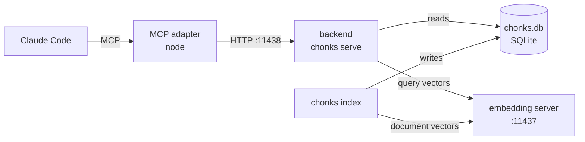

# Chonks: local code retrieval for codebases too big to grep

[](https://github.com/mgonzalez01/Chonks/actions/workflows/ci.yml)

Chonks indexes a large codebase into one local SQLite file and serves it to Claude Code, or any MCP harness, as retrieval tools. There is no LLM inside the pipeline. Retrieval is embeddings, BM25, and graph traversal, and the coding agent does the thinking.

Agentic search with grep, glob, and repo maps works well until the codebase outgrows it. A large codebase has tens of thousands of files, coupling that crosses language boundaries, and names that cannot be guessed, so at that scale an agent spends its context window walking directories. Chonks gives it sharper questions to ask:

- "Where is the thing that does X?" Hybrid semantic and keyword search over AST-boundary chunks (`codebase_search`).
- "Collect everything related to this." Iterative graph-expansion retrieval for multi-hop, cross-subsystem questions (`codebase_research`).
- "Who uses this symbol?" and "Where is it defined?" Structural lookups over a precomputed typed cross-reference graph (`find_usages`, `find_symbol`).
- "What is the shape of this subsystem?" PageRank-ranked structural maps of any subtree (`codebase_map`).

Four processes and one file are involved. The agent talks to a small MCP adapter, the adapter talks to the Python backend over HTTP, and the backend reads the SQLite index and asks the embedding server for query vectors. The same embedding server is used when the index is built.

On 100 held-out Loc-Bench issues, Acc@5 is 64/100, with no LLM in the retrieval loop. Full numbers in [Benchmarks](#benchmarks).



## What gets ingested

Files are chunked in one of two ways, chosen by extension:

| Tier | Extensions | How it is chunked |
|---|---|---|
| AST-aware (full symbol and graph support) | `.c` (C) · `.cs` (C#) · `.cc .cpp .cu .cuh .cxx .h .hpp .hxx .inl .metal .mm` (C++) · `.gd` (GDScript) · `.fx .fxh .hlsl` (HLSL) · `.cjs .js .jsx .mjs` (JavaScript) · `.lua` (Lua) · `.py .pyi` (Python) · `.tsx` (TSX) · `.ts` (TypeScript) | tree-sitter boundaries: functions, classes, methods. Named chunks that feed the symbol index, cross-reference graph, and repomap. |
| Text fallback (searchable, no symbols) | `.html .vue .svelte .md .markdown .yaml .yml .toml .json` (default; edit via the `fallback_extensions` config key, or `[]` to disable) | line-based slices. Docs and config surface in search and research and stay out of the structural graph. |

Everything else is skipped. Adding an AST language is one new file under `chonks/languages/`: `tree-sitter-language-pack` lists 248 grammars, and nothing is bundled, since each grammar downloads into a per-user cache on first use. This means the first index run needs network access once per language it encounters, so an air-gapped machine has to have that cache populated beforehand. Text formats are not languages in that registry; the `fallback_extensions` config key admits them. See [DOCS.md, Adding a language](DOCS.md#adding-a-language).

## When not to use it

On a small or mid-sized repo the agent's built-in search is usually enough, and an index that must be refreshed by hand is a liability there. A stale index is worse than no index. Chonks is for a corpus that is too big to walk and stable enough to index. See [When this helps, and when it doesn't](DESIGN.md#when-this-helps-and-when-it-doesnt) before committing to it.

Reference: [`DOCS.md`](DOCS.md) · Installing, running, serving a team, containers, failure modes: [`DEPLOY.md`](DEPLOY.md) · Design reasoning and measurements: [`DESIGN.md`](DESIGN.md) · Measurement record: [`eval/FREEZES.md`](eval/FREEZES.md) · Literature: [`RELATED.md`](RELATED.md)

---

## Quick start

Prerequisites: [uv](https://astral.sh/uv), Node 18 or newer, and an embedding server with an OpenAI-compatible `/v1/embeddings` endpoint. Commands are given one per line, since `&&` does not work in Windows PowerShell 5.

### 1. Install

```
git clone https://github.com/mgonzalez01/Chonks.git
cd Chonks
uv sync
cd mcp-server
npm install
npm run build
cd ..
```

`make setup` runs the uv and npm commands above. Python 3.11 or newer is required.

### 2. Configure

```
uv run chonks init
```

The wizard asks for the codebase path, suggests excludes it found by scanning the tree, pings the embedding server, and writes `config.json`. Nothing is excluded without confirmation, so `--yes` on its own indexes the scan-detected excludes too, `node_modules` and the like included; add `--auto-exclude` to apply them instead. `--yes` with `--codebase`, `--db`, `--embed-url`, `--embed-model`, and `--auto-exclude` skips the prompts. The embedding server is not started yet at this point (that is step 3), so the wizard's warning that it could not reach it is expected here.

### 3. Start the embedding server

Every number in this README was measured with `jina-code-embeddings-0.5b`, and it is the recommended model. With [llama.cpp](https://github.com/ggerganov/llama.cpp):

```
llama-server --hf-repo jinaai/jina-code-embeddings-0.5b-GGUF --hf-file jina-code-embeddings-0.5b-F16.gguf --embedding --pooling last --port 11437 --parallel 16 --ctx-size 65536 -ngl 99
```

jina-code-embeddings is licensed CC-BY-NC-4.0, which excludes commercial use. `Qwen/Qwen3-Embedding-0.6B-GGUF` is the Apache-2.0 alternative, launched with the same line and `embed_model` set to a name containing `qwen3`. On the 15-instance panel at the F1 code it trailed jina by three questions on flat search, 7 against 10 at Acc@5, and was ahead on research, 9 against 7; the per-instance rows are in `eval/results/F1/`. The model name is recorded in the DB, so changing models means a `--force` re-index into a new DB. See [DESIGN.md, the embedding model](DESIGN.md#the-embedding-model-and-its-prefixes).

### 4. Index

```
uv run chonks index /path/to/source --db .db/chonks.db --config config.json
```

The first run on a large codebase takes minutes to an hour. Re-running processes only changed files, so the same command is also the refresh. The k-NN graph step at the end runs on the CPU unless cupy or mlx is installed, as described in [DOCS.md, k-NN graph](DOCS.md#neighbors-index-time-k-nn-graph).

### 5. Register with Claude Code

`chonks init` prints this command with the paths filled in. In PowerShell the line continuation is a backtick.

```
claude mcp add chonks -s user \
  -e CHONKS_URL=http://localhost:11438 \
  -e CHONKS_SERVER_PY=/absolute/path/to/Chonks/chonks/server.py \
  -e CHONKS_DB=/absolute/path/to/Chonks/.db/chonks.db \
  -e CHONKS_CONFIG=/absolute/path/to/Chonks/config.json \
  -e "CHONKS_PY_CMD=uv run python" \
  -- node /absolute/path/to/Chonks/mcp-server/dist/index.js
```

`CHONKS_SERVER_PY` alone enables managed mode, where the adapter starts the backend itself, so nothing else has to be running; `CHONKS_DB` and `CHONKS_CONFIG` are passed through as arguments to the backend it starts. Without `CHONKS_SERVER_PY` the adapter only connects, and `uv run chonks serve --db .db/chonks.db --config config.json` has to be started by hand. Either way the backend refuses to start if the embedding server does not answer; `--allow-degraded` serves keyword-only instead. Open Claude Code, run `/mcp`, and confirm that `chonks` lists its tools.

### 6. Add the steering text

Copy [`mcp-server/CLAUDE.md`](mcp-server/CLAUDE.md) into your project's `CLAUDE.md` or into `~/.claude/CLAUDE.md`. This step decides whether the agent uses the index at all. On a 24-question harness, a one-line recommendation led to 4 runs out of 24 using the tools, and the text in `CLAUDE.md` led to 24 of 24; see [`eval/results/F1`](eval/results/F1/README.md) for the per-run rows.

### Containers instead of steps 1 and 5

```
cp .env.example .env
docker compose up -d
```

This builds the backend and the MCP adapter, expects `chonks.db` and `config.json` under `./data`, and publishes only the adapter on `127.0.0.1:11439`. The registration is then `claude mcp add --transport http chonks http://localhost:11439/mcp`. Optional profiles run the embedder and the indexer inside the stack too. The traps, in particular that `embed_url` must be reachable from inside the container, are in [DEPLOY.md, Containers](DEPLOY.md#7-containers).

### Sharing one index across machines

One machine can hold the index and serve it over HTTP, so that the other machines run nothing but their own Claude Code and register it with a single `claude mcp add` command. There is no authentication, so this is for trusted networks only. The host scripts and the operational details are in [DEPLOY.md](DEPLOY.md).

---

## Benchmarks

All numbers are from measurement freeze F1. [`eval/FREEZES.md`](eval/FREEZES.md) records the code, embedder, defaults, corpora, caveats, and the per-run result files.

Issue localization on 100 held-out Loc-Bench instances, chosen before any tuning. Acc@5 means every file the fix touched is in the top five results.

| mode | Acc@5 | Acc@10 |
|---|---|---|
| `codebase_search` (hybrid) | 64 / 100 (95% interval 54 to 73) | 73 / 100 |
| `codebase_research` | 64 / 100 (95% interval 54 to 73) | 74 / 100 |

The LARGER paper's table, cited in [RELATED.md](RELATED.md), places LLM-driven agentic localizers between 62 and 75 on the full benchmark. Chonks sits in that range with no LLM in the loop, in one call, in under a second.

Feature-set coverage at a fixed 50-chunk budget, where gold is the set of non-test files a real commit touched:

| corpus | n | `codebase_search` | `codebase_research` | wins / ties / losses |
|---|---|---|---|---|
| Godot engine | 20 | 0.678 | **0.843** | 12 / 8 / 0 |

Single-answer localization is bound by the embedder, and a flat-vector baseline ties Chonks there. The separation is on set-valued questions, where graph expansion recovers the files whose text does not resemble the query. Sample sizes are small.

## License

Chonks is released under the [Apache License 2.0](LICENSE). The default embedding model, `jina-code-embeddings-0.5b`, is a separate download under its own CC-BY-NC-4.0 licence, which excludes commercial use. Step 3 names the Apache-2.0 alternative.
